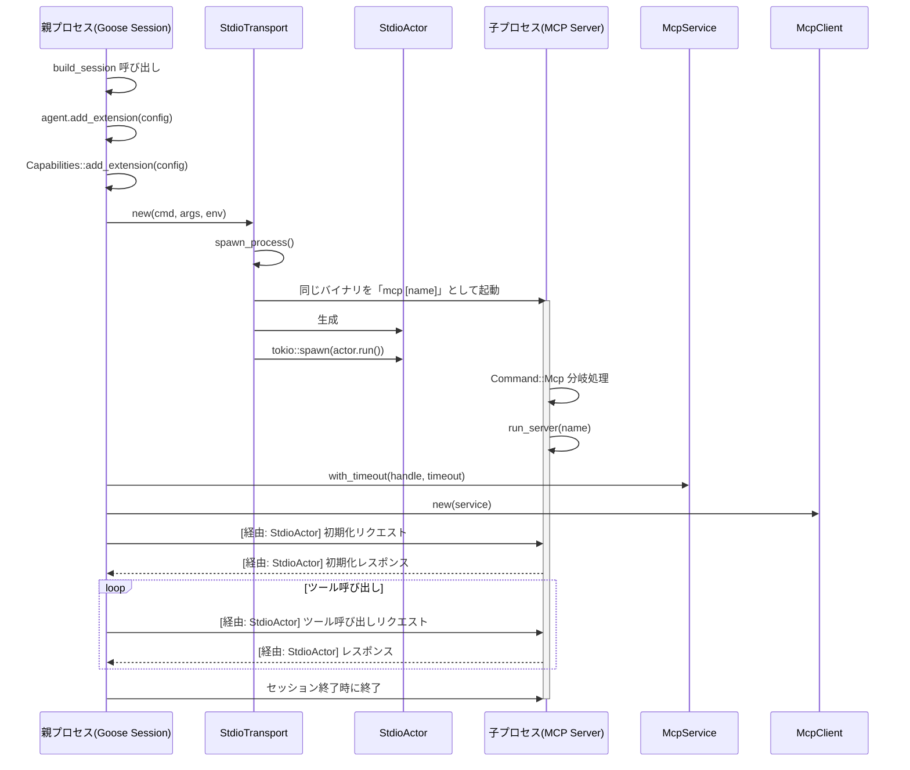

# MCP サーバー初期化メカニズムの解析

## 問題の概要

`session_builder.rs` サンプルコードを実行した際に、以下のコードブロックを削除すると computercontroller 拡張機能の初期化が失敗します。

```rust
Some(Command::Mcp { name }) => {
    println!("Running mcp server: {}", name);
    let _ = run_server(&name).await;
}
```

エラーメッセージ:
```
Failed to start extension: computercontroller, "Failed to start the MCP server from configuration `Builtin(computercontroller)` `Call to '' failed for 'initialize'. Error from mcp-server: Stdio process error: thread 'main' panicked at crates/goose-cli/examples/session_builder.rs:486:13:\nUnknown command\nstack backtrace:\n   0: rust_begin_unwind\n             at /rustc/f6e511eec7342f59a25f7c0534f1dbea00d01b14/library/std/src/panicking.rs:662:5\n   1: core::panicking::panic_fmt\n             at /rustc/f6e511eec7342f59a25f7c0534f1dbea00d01b14/library/core/src/panicking.rs:74:14\n   2: session_builder::cli::{{closure}}\n             at ./crates/goose-cli/examples/session_builder.rs:486:13\n   3: session_builder::main::{{closure}}\n             at ./crates/goose-cli/examples/session_builder.rs:494:11\n   4: <core::pin::Pin<P> as core::future::future::Future>::poll\n             at /rustc/f6e511eec7342f59a25f7c0534f1dbea00d01b14/library/core/src/future/future.rs:123:9\n   5: tokio::runtime::park::CachedParkThread::block_on::{{closure}}\n             at /Users/nishimura/.cargo/registry/src/index.crates.io-6f17d22bba15001f/tokio-1.43.0/src/runtime/park.rs:284:63\n   6: tokio::runtime::coop::with_budget\n             at /Users/nishimura/.cargo/registry/src/index.crates.io-6f17d22bba15001f/tokio-1.43.0/src/runtime/coop.rs:107:5\n   7: tokio::runtime::coop::budget\n             at /Users/nishimura/.cargo/registry/src/index.crates.io-6f17d22bba15001f/tokio-1.43.0/src/runtime/coop.rs:73:5\n   8: tokio::runtime::park::CachedParkThread::block_on\n             at /Users/nishimura/.cargo/registry/src/index.crates.io-6f17d22bba15001f/tokio-1.43.0/src/runtime/park.rs:284:31\n   9: tokio::runtime::context::blocking::BlockingRegionGuard::block_on\n             at /Users/nishimura/.cargo/registry/src/index.crates.io-6f17d22bba15001f/tokio-1.43.0/src/runtime/context/blocking.rs:66:9\n  10: tokio::runtime::scheduler::multi_thread::MultiThread::block_on::{{closure}}\n             at /Users/nishimura/.cargo/registry/src/index.crates.io-6f17d22bba15001f/tokio-1.43.0/src/runtime/scheduler/multi_thread/mod.rs:87:13\n  11: tokio::runtime::context::runtime::enter_runtime\n             at /Users/nishimura/.cargo/registry/src/index.crates.io-6f17d22bba15001f/tokio-1.43.0/src/runtime/context/runtime.rs:65:16\n  12: tokio::runtime::scheduler::multi_thread::MultiThread::block_on\n             at /Users/nishimura/.cargo/registry/src/index.crates.io-6f17d22bba15001f/tokio-1.43.0/src/runtime/scheduler/multi_thread/mod.rs:86:9\n  13: tokio::runtime::runtime::Runtime::block_on_inner\n             at /Users/nishimura/.cargo/registry/src/index.crates.io-6f17d22bba15001f/tokio-1.43.0/src/runtime/runtime.rs:370:45\n  14: tokio::runtime::runtime::Runtime::block_on\n             at /Users/nishimura/.cargo/registry/src/index.crates.io-6f17d22bba15001f/tokio-1.43.0/src/runtime/runtime.rs:340:13\n  15: session_builder::main\n             at ./crates/goose-cli/examples/session_builder.rs:494:5\n  16: core::ops::function::FnOnce::call_once\n             at /rustc/f6e511eec7342f59a25f7c0534f1dbea00d01b14/library/core/src/ops/function.rs:250:5\nnote: Some details are omitted, run with `RUST_BACKTRACE=full` for a verbose backtrace.\n`"
```

## 調査結果

### 拡張機能の初期化プロセス

この問題を調査した結果、Gooseにおけるビルトイン拡張機能の初期化メカニズムの興味深い実装が明らかになりました。

1. 拡張機能の初期化フロー:
   ```
   build_session → agent.add_extension() → Capabilities::add_extension() → サブプロセス起動
   ```

2. `Capabilities::add_extension`メソッドでは、ビルトイン拡張機能(`ExtensionConfig::Builtin`)の場合、現在実行中のGooseバイナリを子プロセスとして起動し、MCPサーバーをホストします。

3. 重要な実装部分:
   ```rust
   ExtensionConfig::Builtin {
       name,
       display_name,
       timeout,
   } => {
       // For builtin extensions, we run the current executable with mcp and extension name
       let cmd = std::env::current_exe()
           .expect("should find the current executable")
           .to_str()
           .expect("should resolve executable to string path")
           .to_string();
       let transport = StdioTransport::new(
           &cmd,
           vec!["mcp".to_string(), name.clone()],
           HashMap::new(),
       );
       let handle = transport.start().await?;
       let service = McpService::with_timeout(
           handle,
           Duration::from_secs(
               timeout.unwrap_or(crate::config::DEFAULT_EXTENSION_TIMEOUT),
           ),
       );
       Box::new(McpClient::new(service))
   }
   ```

### サブプロセス起動と通信の詳細実装

#### 1. StdioTransport：子プロセスの立ち上げと通信チャネル確立

`StdioTransport` クラスは子プロセスと標準入出力（stdin/stdout/stderr）を通じて通信するためのトランスポート層を実装しています。

```rust
pub struct StdioTransport {
    command: String,      // 実行するコマンド（バイナリへのパス）
    args: Vec<String>,    // コマンドライン引数
    env: HashMap<String, String>, // 環境変数
}
```

核となる処理は `spawn_process()` メソッドで、以下のような処理を行います：

1. `Command::new()` で子プロセスを構成
2. 必要な環境変数と引数の設定
3. 標準入出力のパイプ設定 (`std::process::Stdio::piped()`)
4. プロセス終了時にのクリーンアップ設定 (`kill_on_drop(true)`)
5. プラットフォーム固有設定（Unixではプロセスグループ設定、Windowsではコンソールウィンドウ非表示設定）

```rust
// Unixシステム（macOS, Linux）では親プロセスからシグナルハンドリングを継承しない
#[cfg(unix)]
command.process_group(0);

// Windowsではコンソールウィンドウを表示しない
#[cfg(windows)]
command.creation_flags(0x08000000); // CREATE_NO_WINDOW フラグ
```

`start()` メソッドでは、子プロセスの起動後、非同期通信のための `StdioActor` を生成し、バックグラウンドタスクとして実行します：

```rust
tokio::spawn(actor.run());
```

#### 2. StdioActor：双方向通信の処理

`StdioActor` は非同期のメッセージ処理を担当し、以下の重要な役割を持ちます：

1. 入出力ストリーム管理：子プロセスの `stdin`、`stdout`、`stderr` を非同期に処理
2. メッセージキュー： `tokio::mpsc` チャネルを使用して親プロセスからのメッセージを処理
3. 並行処理： `tokio::select!` を使用して複数のストリームを同時に監視

特に重要なのは以下の3つの同時処理：
```rust
tokio::select! {
    result = &mut incoming => { /* 子プロセスからの出力処理 */ }
    result = &mut outgoing => { /* 子プロセスへの入力処理 */ }
    status = self._process.wait() => { /* プロセス終了検知 */ }
}
```

このアーキテクチャにより、子プロセスとのリアルタイム双方向通信が可能になります。

#### 3. McpService：トランスポートのラッパーと抽象化

`McpService` は `Tower` フレームワークに基づいた抽象化レイヤーで、トランスポートを `Service` トレイトに適合させる役割を持ちます：

```rust
pub struct McpService<T: TransportHandle> {
    inner: Arc<T>,
}
```

主な機能：
1. トランスポートをラップし、共有可能にする（`Arc`で包む）
2. タイムアウト機能の追加（`with_timeout`メソッド）
3. 非同期サービス呼び出しを `Service` トレイトに従って提供

`with_timeout` を使用すると、指定した時間内に応答がない場合エラーを返します：

```rust
pub fn with_timeout(transport: T, timeout: std::time::Duration) -> Timeout<McpService<T>> {
    ServiceBuilder::new()
        .timeout(timeout)
        .service(McpService::new(transport))
}
```

#### 4. McpClient：高レベルAPI提供

`McpClient` はMCPプロトコルに基づいた高レベルAPIを提供し、以下の処理を担います：

1. JSON-RPC通信： リクエスト・レスポンスのフォーマット管理
2. ID管理： 非同期リクエストとレスポンスのマッチング
3. 初期化フロー： MCP拡張機能の初期化処理と機能検出（ケイパビリティネゴシエーション）
4. エラーハンドリング： 通信やプロトコルレベルのエラー処理

重要メソッド：
- `initialize()`: JSON-RPC初期化プロトコルを実行し機能検出
- `list_tools()`, `call_tool()`: ツール一覧取得や呼び出し
- `list_resources()`, `read_resource()`: リソース一覧取得や読み込み
- `list_prompts()`, `get_prompt()`: プロンプト一覧取得や読み込み

### サーバー初期化の全体的な流れ

1. `agent.add_extension(config.clone())`が呼び出されると、内部的に同じバイナリを `mcp [extension-name]` のコマンドライン引数で子プロセスとして起動します。

2. 子プロセスは親プロセスと同じコードベースを実行しますが、コマンドラインパラメータが異なり、`Mcp` コマンドとして処理されます。

3. 子プロセス側では以下の処理が実行されるはずです:
   ```rust
   Some(Command::Mcp { name }) => {
       println!("Running mcp server: {}", name);
       let _ = run_server(&name).await;
   }
   ```

4. この部分を削除すると、子プロセスが正しく MCPサーバーを初期化できず、エラーが発生します。

### 通信詳細フロー

2つの方式での拡張機能起動方法が実装されています：

#### 1. Stdio拡張機能の場合：

```rust
ExtensionConfig::Stdio {
    cmd,
    args,
    envs,
    timeout,
    ..
} => {
    println!("Adding Stdio extension: {}({})", cmd, args.join(","));
    let transport = StdioTransport::new(cmd, args.to_vec(), envs.get_env());
    let handle = transport.start().await?;
    let service = McpService::with_timeout(
        handle,
        Duration::from_secs(
            timeout.unwrap_or(crate::config::DEFAULT_EXTENSION_TIMEOUT),
        ),
    );
    Box::new(McpClient::new(service))
}
```

この場合、外部コマンド（`cmd`）が直接実行され、MCP拡張機能として動作します。コマンドは任意のプログラムで、MCP互換のレスポンスを標準入出力を介して提供する必要があります。

#### 2. ビルトイン拡張機能の場合：

```rust
ExtensionConfig::Builtin {
    name,
    display_name,
    timeout,
} => {
    // 現在実行中のバイナリを子プロセスとして起動
    let cmd = std::env::current_exe()
        .expect("should find the current executable")
        .to_str()
        .expect("should resolve executable to string path")
        .to_string();
    println!("Adding builtin extension: {}, cmd: {}", name, &cmd);
    let transport = StdioTransport::new(
        &cmd,
        vec!["mcp".to_string(), name.clone()],
        HashMap::new(),
    );
    let handle = transport.start().await?;
    let service = McpService::with_timeout(
        handle,
        Duration::from_secs(
            timeout.unwrap_or(crate::config::DEFAULT_EXTENSION_TIMEOUT),
        ),
    );
    Box::new(McpClient::new(service))
}
```

こちらは、現在実行中の同じGooseバイナリを異なるコマンドライン引数で子プロセスとして起動し、その子プロセスがMCPサーバーとして動作します。

### 実際の通信フロー



## 解決策と教訓

### 解決策

1. 削除されたコードブロックを復元する:

```rust
Some(Command::Mcp { name }) => {
    println!("Running mcp server: {}", name);
    let _ = run_server(&name).await;
}
```

このコードブロックは子プロセスがMCP拡張機能として動作するために必須の分岐処理です。

2. もしくは、`build_session()` を呼び出す前に必要なMCPサーバーを手動で起動する:

```rust
// コマンドがNoneの場合
let extensions = goose::config::ExtensionManager::get_all()
    .expect("Failed to get extensions");

// ビルトイン拡張機能のMCPサーバーを起動
for ext in extensions {
    if ext.enabled {
        if let goose::agents::ExtensionConfig::Builtin { name, .. } = &ext.config {
            if name == "computercontroller" {
                println!("Starting MCP server for computercontroller extension");
                let _ = run_server("computercontroller").await;
                break; // 一度だけ起動する必要がある
            }
        }
    }
}

// その後通常通りbuild_sessionを実行
let mut session = build_session(None, false, vec![], vec![], false).await;
```

### 子プロセスの起動と通信まとめ

1. **プロセス分離設計**: 拡張機能を別プロセスとして実行することで、クラッシュした場合でもメインプロセスには影響しない堅牢性を確保しています。

2. **トランスポート層の抽象化**:
   - `StdioTransport`: 子プロセスの起動と標準入出力の通信チャネル確立
   - `StdioActor`: 標準入出力を通じた非同期通信の管理
   - `McpService`: トランスポートを `Tower` のサービス抽象化に適合させる
   - `McpClient`: MCP APIを使いやすい形で提供

3. **主なメリット**:
   - **分離性**: 拡張機能の障害がメインプロセスに波及しない
   - **リソース制限**: 各プロセスに独立したリソース制限を設定可能
   - **並行処理**: 複数の拡張機能を効率的に並行実行

4. **制約事項**:
   - コマンドラインのパース処理が必須（削除するとエラー）
   - プロセス間通信によるオーバーヘッド
   - デバッグが複雑になる可能性

### 教訓

1. **サブプロセス通信モデル**: Gooseのビルトイン拡張機能は、同じバイナリをサブプロセスとして起動し、標準入出力を通じて通信するモデルを使用しています。これによりプロセス分離の利点を得ながら、単一バイナリ配布が可能になっています。

2. **CLIコマンドの重要性**: 一見使用されていないように見えるCLIコマンドハンドラーが、内部的なサブプロセス実行に重要な役割を果たしています。このような「コマンドマッピング」パターンはシングルバイナリで複数の動作モードを実現する効果的な方法です。

3. **多層設計パターン**: StdioTransport → StdioActor → McpService → McpClient という多層設計により、各層が特定の責務を持ち、テストや機能拡張が容易になっています。

## 参考資料

- `crates/goose/src/agents/capabilities.rs`: ビルトイン拡張機能の初期化処理
- `crates/goose-cli/src/commands/mcp.rs`: MCPサーバー実装
- `crates/mcp-client/src/client.rs`: MCPクライアント実装
- `crates/mcp-client/src/service.rs`: McpServiceの実装
- `crates/mcp-client/src/transport/stdio.rs`: StdioTransportとStdioActorの実装
- `crates/mcp-client/src/transport/mod.rs`: トランスポート抽象化
- `crates/mcp-core/src/protocol.rs`: MCPプロトコルの定義