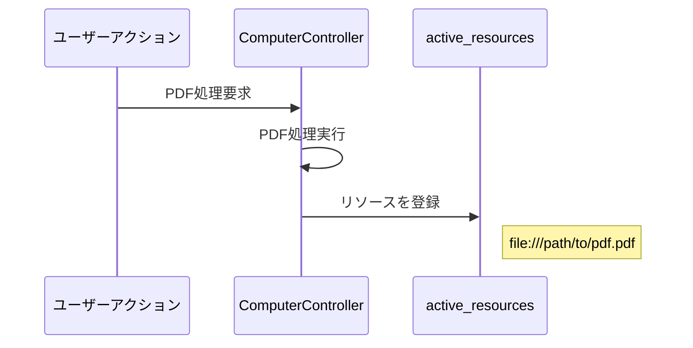
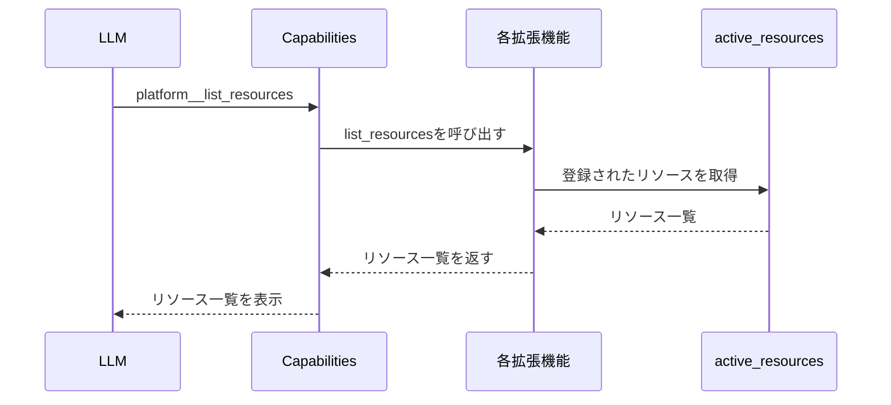
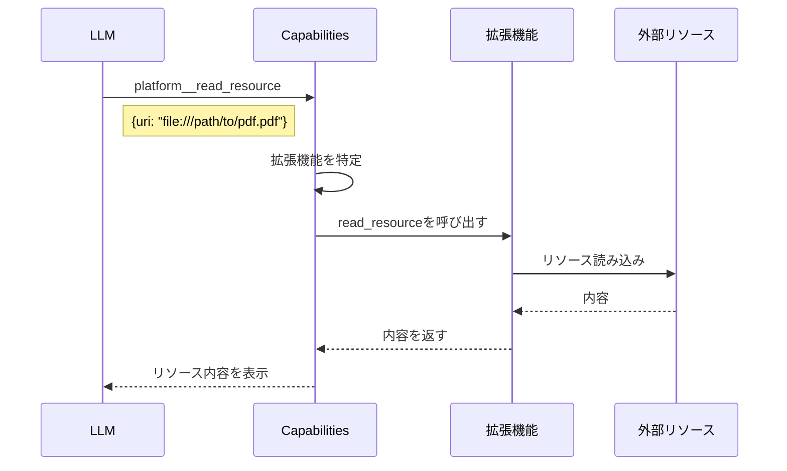

# Gooseの`capabilities.rs`解析

## 概要

`crates/goose/src/agents/capabilities.rs`は、Gooseエージェントの中核となる機能を提供するモジュールです。このファイルは、拡張機能の管理、ツールの統合、システムプロンプトの生成などの重要な役割を担っています。

## Capabilitiesの構造

```rust
pub struct Capabilities {
    clients: HashMap<String, McpClientBox>,
    frontend_tools: HashMap<String, FrontendTool>,
    instructions: HashMap<String, String>,
    resource_capable_extensions: HashSet<String>,
    provider: Arc<Box<dyn Provider>>,
    system_prompt_override: Option<String>,
    system_prompt_extensions: Vec<String>,
}
```

### 主要なフィールド

- **clients**: 拡張機能の名前とMCP（Messaging Control Protocol）クライアントのマッピング
- **frontend_tools**: フロントエンドで実行されるツール
- **instructions**: 拡張機能とその説明文のマッピング
- **resource_capable_extensions**: リソース機能をサポートする拡張機能のセット
- **provider**: LLMプロバイダー（GPT-4など）
- **system_prompt_override**: システムプロンプトのオーバーライド（設定されている場合）
- **system_prompt_extensions**: システムプロンプトに追加される拡張機能の説明

## 主要な機能

### 1. 拡張機能の管理

```rust
pub async fn add_extension(&mut self, config: ExtensionConfig) -> ExtensionResult<()>
pub async fn remove_extension(&mut self, name: &str) -> ExtensionResult<()>
pub async fn list_extensions(&self) -> ExtensionResult<Vec<String>>
```

これらのメソッドは、Gooseエージェントに新しい拡張機能を追加したり、既存の拡張機能を削除したり、現在利用可能な拡張機能を一覧表示するために使用されます。

### 2. ツールの収集と統合

```rust
pub async fn get_prefixed_tools(&mut self) -> ExtensionResult<Vec<Tool>>
```

このメソッドは、すべての有効な拡張機能からツールを収集し、名前空間の衝突を避けるためにプレフィックスを付与します。例えば、`fetch`拡張機能の`get`ツールは`fetch__get`として提供されます。

実装の流れ：
1. フロントエンドツールを直接追加（すでに一意に命名されているため）
2. MCP拡張機能からのツールを収集し、拡張機能名でプレフィックスを付与
3. すべてのツールを結合して返す

### 3. ツール呼び出しのディスパッチ

```rust
pub async fn dispatch_tool_call(&self, tool_call: ToolCall) -> ToolResult<Vec<Content>>
```

このメソッドは、LLMから受け取ったツール呼び出しを適切な拡張機能にルーティングする役割を担います。

処理の流れ：
1. プラットフォーム固有のツール（`platform__read_resource`など）を内部で処理
2. フロントエンドツールの場合、フロントエンド実行が必要であることを示すエラーを返す
3. それ以外の場合、ツール名のプレフィックスを使用して適切な拡張機能クライアントを特定
4. クライアントにツール呼び出しを転送し、結果を返す

### 4. システムプロンプトの生成

```rust
pub async fn get_system_prompt(&self) -> String
```

このメソッドは、LLMに送信される最終的なシステムプロンプトを生成します。

実装の流れ：
1. 各拡張機能の情報（名前、説明、リソースのサポート状況）を収集
2. フロントエンドツールが存在する場合、それらも特別な拡張機能として追加
3. 拡張機能の情報をコンテキストに追加
4. システムプロンプトの追加拡張機能や構成オーバーライドを適用
5. テンプレートエンジンを使用して最終的なシステムプロンプトを生成

### 5. プラットフォーム機能（`platform__` ツール）

`capabilities.rs`は、Gooseプラットフォーム自体が提供するツールの定義と実装も含んでいます。これらのツールは `platform__` プレフィックスで識別され、LLMに直接提供されます。

#### リソース管理

```rust
async fn read_resource(&self, params: Value) -> Result<Vec<Content>, ToolError>
async fn list_resources(&self, params: Value) -> Result<Vec<Content>, ToolError>
```

- **platform__read_resource**: 指定されたリソースURIの内容を読み取る
  - 特定の拡張機能名が指定されている場合はその拡張機能から、そうでない場合はリソース対応の全拡張機能から検索します
  - パラメータ: `uri`（必須）、`extension_name`（オプション）

- **platform__list_resources**: 利用可能なリソースの一覧を取得する
  - 特定の拡張機能が指定されている場合はその拡張機能のリソースのみ、そうでない場合はすべての拡張機能のリソースを一覧表示します
  - パラメータ: `extension`（オプション）

これらのメソッドは、LLMが参照できるリソース（ドキュメント、コードなど）を管理します。

#### 拡張機能の検索と有効化

```rust
pub async fn search_available_extensions(&self) -> Result<Vec<Content>, ToolError>
```

- **platform__search_available_extensions**: 利用可能だが現在有効になっていない拡張機能を検索します
  - 返される情報には拡張機能の名前と説明が含まれ、LLMにタスク実行に適した拡張機能を提案できるようにします
  - パラメータ: なし

- **platform__enable_extension**: 指定された拡張機能を有効にします
  - この機能は `truncate.rs` に実装されています
  - パラメータ: `extension_name`（必須）
  - 拡張機能が見つからない場合、または有効化に失敗した場合はエラーを返します

#### プランニングプロンプトの生成

```rust
pub async fn get_planning_prompt(&self, tools_info: Vec<ToolInfo>) -> String
```

このメソッドは、LLMにタスクプランを作成させるためのプロンプトを生成します。

## URIとリソースの具体的な実装

Gooseの拡張機能が提供する「リソース」について、より詳細に説明します。

### リソースの定義

`mcp-core/src/resource.rs`では、リソースが以下のように定義されています：

```rust
pub struct Resource {
    /// URI representing the resource location (e.g., "file:///path/to/file" or "str:///content")
    pub uri: String,
    /// Name of the resource
    pub name: String,
    /// Optional description of the resource
    pub description: Option<String>,
    /// MIME type of the resource content ("text" or "blob")
    pub mime_type: String,
    pub annotations: Option<Annotations>,
}
```

また、リソースの実際の内容は`ResourceContents`という列挙型で表されます：

```rust
pub enum ResourceContents {
    TextResourceContents {
        uri: String,
        mime_type: Option<String>,
        text: String,
    },
    BlobResourceContents {
        uri: String,
        mime_type: Option<String>,
        blob: String, // Base64エンコードされたバイナリデータ
    },
}
```

### リソース提供の主な拡張機能

実際に外部情報をリソースとして提供している主な拡張機能には以下があります：

1. **Computer Controller拡張機能** (`goose-mcp/src/computercontroller/mod.rs`)
   - **PDF処理**: PDFファイルからテキストや画像を抽出
   - **キャッシュ機能**: 外部データをキャッシュとして保存・管理
   - **Webスクレイピング**: Webページの内容を取得・解析
   - **Excel (XLSX)処理**: Excelファイルの内容を操作
   - **Word (DOCX)処理**: Wordファイルの内容を操作

2. **Google Drive拡張機能** (`goose-mcp/src/google_drive/mod.rs`)
   - Google Driveからのファイル取得・操作

3. **JetBrains拡張機能** (`goose-mcp/src/jetbrains/mod.rs`)
   - IDEからのコード・プロジェクト情報の取得

### リソースの処理フロー

1. **リソースの登録**:
   拡張機能が初期化時または特定のアクション時に、URI識別子に対応するリソースを登録します。

   ```rust
   // Computer Controller拡張機能での例
   self.active_resources.lock().unwrap().insert(uri, resource);
   ```

2. **リソース一覧の取得**:
   LLMが`platform__list_resources`ツールを呼び出すと、`capabilities.rs`は登録されたすべての拡張機能からリソースの一覧を収集します。

   ```rust
   // Computer Controller拡張機能での実装
   fn list_resources(&self) -> Vec<Resource> {
       let active_resources = self.active_resources.lock().unwrap();
       let resources = active_resources.values().cloned().collect();
       resources
   }
   ```

3. **リソースの読み込み**:
   LLMが`platform__read_resource`ツールでURIを指定すると、対応する拡張機能がそのリソースの内容を読み込みます。

   ```rust
   // Computer Controller拡張機能での実装
   fn read_resource(&self, uri: &str) -> Pin<Box<dyn Future<Output = Result<String, ResourceError>> + Send + 'static>> {
       // URIからリソースを読み込む処理
   }
   ```

### 具体的な例：PDF処理

PDF処理は、ComputerController拡張機能の一部として実装されています。以下はその例です：

```rust
// PDFファイルからテキストを抽出する処理の一部
pub async fn pdf_tool(path: &str, operation: &str, cache_dir: &Path) -> Result<Vec<Content>, ToolError> {
    // PDFファイルを開いて解析
    let doc = Document::load(path)
        .map_err(|e| ToolError::ExecutionError(format!("Failed to open PDF file: {}", e)))?;
    
    // テキスト抽出などの操作を実行
    let result = match operation {
        "extract_text" => { /* テキスト抽出処理 */ }
        "extract_images" => { /* 画像抽出処理 */ }
        _ => { /* エラー処理 */ }
    };
    
    Ok(vec![Content::text(result)])
}
```

### URIの種類

リソースのURIは様々な形式があり、スキーマによってリソースの種類を識別します：

- **file://**: ファイルシステム上のファイル
- **http://** または **https://**: Web上のリソース
- **gdrive://**: Google Drive上のファイル
- **str://**: 文字列として直接保持されたコンテンツ

### まとめ

リソースは、Gooseがさまざまな外部情報（ファイル、Webページ、IDEのコードなど）にアクセスするための統一的なインターフェースを提供します。URIベースの識別によって、様々なソースのデータを一貫した方法で参照・利用することができます。リソース機能をサポートする拡張機能は特別に登録され、リソースの一覧表示や読み込みの機能を実装する必要があります。

## リソースアクセスの流れ

Gooseから外部リソース（PDFやWebページなど）へのアクセス流れを整理します。

### 1. 全体の流れ

```
ユーザー → Agent → Capabilities → 拡張機能(e.g. ComputerController) → 外部リソース(e.g. PDF)
```

1. **ユーザーが指示を出す**: 「PDFから情報を取得して」など
2. **Agent**: LLMが`platform__list_resources`や`platform__read_resource`ツールを呼び出す
3. **Capabilities**: 適切な拡張機能にツール呼び出しをディスパッチ
4. **拡張機能**: PDF処理などを実行し結果を返す
5. **LLM**: 結果を受け取ってユーザーに応答

### 2. リソース登録の流れ



1. ユーザーが、直接またはLLMを通じて、ComputerControllerの`pdf_tool`を実行する
2. PDF処理が完了すると、ComputerControllerはその結果を`active_resources`にリソースとして登録する
3. このリソースは`file:///path/to/pdf.pdf`のようなURIで識別される

### 3. platform__list_resourcesの流れ



1. LLMが`platform__list_resources`ツールを呼び出す
2. Capabilitiesの`list_resources`メソッドが処理を行う
3. リソース対応の各拡張機能の`list_resources`を呼び出す
4. 各拡張機能は自分が既に登録しているリソース一覧を返す
5. LLMは利用可能なすべてのリソースの一覧を受け取る

### 4. platform__read_resourceの流れ



1. LLMが`platform__read_resource`ツールをURIを指定して呼び出す
2. Capabilitiesの`read_resource`メソッドが処理を行う
3. URIに基づいて、対応する拡張機能を特定する
4. 拡張機能の`read_resource`を呼び出し、内容を取得
5. LLMはリソースの内容を受け取る

### 例：PDFファイル処理の場合

1. **リソースとしてのPDF**:
   - PDFは、ComputerControllerが`pdf_tool`を通じて処理することができる外部リソース
   - PDFから抽出されたテキストや画像は、`active_resources`に登録される

2. **platform__list_resourcesとPDFの関係**:
   - LLMが`platform__list_resources`を呼び出すと、ComputerControllerが`list_resources`を実行
   - その結果、PDFから抽出されたリソースも含めた一覧がLLMに返される
   - LLMは、どのリソースが利用可能かを確認できる

3. **platform__read_resourceとPDFの関係**:
   - LLMが`platform__read_resource`を呼び出してPDF関連のURIを指定すると
   - ComputerControllerの`read_resource`メソッドが、そのリソースの内容を読み込み
   - 結果として、PDFから抽出されたテキストや画像の内容がLLMに返される

このような仕組みにより、LLMは`ComputerController`拡張機能が処理したPDFの内容にアクセスし、その情報を利用してユーザーの質問に応答することができます。

### 例：PDFファイル処理の場合

1. **リソースとしてのPDF**:
   - PDFは、ComputerControllerが`pdf_tool`を通じて処理することができる外部リソース
   - PDFから抽出されたテキストや画像は、`active_resources`に登録される

2. **platform__list_resourcesとPDFの関係**:
   - LLMが`platform__list_resources`を呼び出すと、ComputerControllerが`list_resources`を実行
   - その結果、PDFから抽出されたリソースも含めた一覧がLLMに返される
   - LLMは、どのリソースが利用可能かを確認できる

3. **platform__read_resourceとPDFの関係**:
   - LLMが`platform__read_resource`を呼び出してPDF関連のURIを指定すると
   - ComputerControllerの`read_resource`メソッドが、そのリソースの内容を読み込み
   - 結果として、PDFから抽出されたテキストや画像の内容がLLMに返される

このような仕組みにより、LLMは`ComputerController`拡張機能が処理したPDFの内容にアクセスし、その情報を利用してユーザーの質問に応答することができます。

### 5. 具体的なユースケース：PDFを使った質問応答

ユーザーが「〇〇のPDFについて調べて」と指示してから、PDFに関する質問をするまでのフローを詳しく解説します。

1. **ユーザーの最初の指示**:
   ```
   「〇〇のPDFについて調べて」
   ```

2. **LLMの判断と処理**:
   - LLMはこの要求を分析し、PDFの取得が必要だと判断
   - ComputerController拡張機能のツールを使用すべきだと決定

3. **PDFの取得と処理**:
   - `computercontroller__web_scrape` または類似ツールを使って、指定されたPDFをウェブから取得
   - または `computercontroller__pdf_tool` を使用して既存のPDFを処理
   - 処理されたPDFのテキストや画像は拡張機能内の `active_resources` に保存される
   - 各リソースには一意のURI（例: `file:///path/to/cached/pdf.pdf`）が割り当てられる

4. **ユーザーによる質問**:
   ```
   「そのPDFの第3章について教えて」
   ```

5. **LLMによるリソース利用**:
   - LLMは前のステップでPDFが処理されたことを記憶している
   - まず `platform__list_resources` を呼び出して、利用可能なリソース（PDF）を確認
   - 次に `platform__read_resource` を呼び出し、該当するPDFリソースの内容を取得
   - URIを指定：`{uri: "file:///path/to/cached/pdf.pdf"}`

6. **バックエンド処理**:
   - `capabilities.rs` はこのリクエストを受け取り、URIを基に適切な拡張機能（ComputerController）にルーティング
   - ComputerControllerの `read_resource` メソッドが呼び出され、登録済みのリソースから内容を返す

7. **質問への回答**:
   - LLMはリソースから取得した内容を分析し
   - 「第3章」に関連する情報を抽出
   - ユーザーの質問に対して、PDF内容に基づいた回答を生成

### 重要なポイント

- PDFは1回処理されるだけで、その後は何度も `read_resource` でアクセス可能
- リソースはURIで識別され、実際の内容はComputerController内の `active_resources` に保持される
- 複数の質問に対しても、同じリソースに繰り返しアクセスできる
- PDFの処理はファイルシステム上でキャッシュされ、URIで参照される

このフローにより、ユーザーはPDFを一度指定するだけで、その後はPDFの内容に基づいた様々な質問に対して回答を得ることができます。拡張機能とリソースの仕組みが、このような複雑な情報アクセスを可能にしています。
EOF 2>&1
## 拡張機能との連携

`capabilities.rs`は、Gooseの拡張機能アーキテクチャの中心的な役割を果たします。

1. **MCP（Messaging Control Protocol）クライアント**を使用して拡張機能と通信
2. 各拡張機能から**ツール定義を収集**し、名前空間を管理
3. 拡張機能の**説明をシステムプロンプトに統合**し、LLMに各拡張機能の使用方法を伝える
4. ツール呼び出しを**適切な拡張機能にルーティング**

## まとめ

`capabilities.rs`は、Gooseエージェントの「能力」を定義し管理する中核的なコンポーネントです。このモジュールにより、Gooseは：

- 動的に拡張機能を追加・削除できる
- 様々な拡張機能からのツールを統合できる
- ツール呼び出しを適切な拡張機能にルーティングできる
- 拡張機能の説明を含む包括的なシステムプロンプトを生成できる
- リソース機能をサポートする拡張機能を特定し、リソースへのアクセスを提供できる

これらの機能により、Gooseは柔軟で拡張可能なAIエージェントとして機能します。