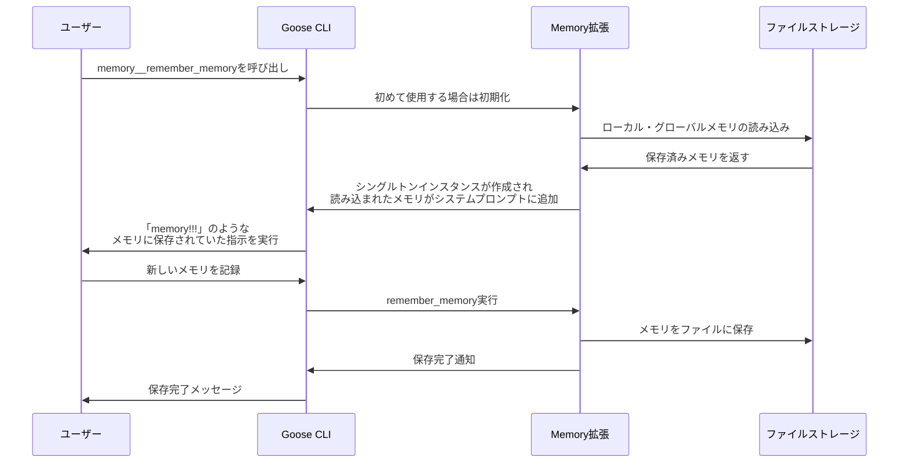

# Gooseのメモリ機能の内部実装と動作原理

## 概要

Gooseのメモリ機能は、ユーザーの重要な情報を保存し、後のセッションで参照できるようにする機能です。この文書では、Gooseのメモリ機能の内部実装と実際の動作原理について詳しく説明します。



## メモリ機能の初期化タイミング

Gooseのメモリ機能は、**起動時には自動的に初期化されない**ことが重要なポイントです。メモリ拡張機能は、以下のいずれかのタイミングで初期化されます：

1. **明示的にMCP経由で起動した場合**:
   ```bash
   goose mcp memory
   ```

2. **セッション開始時に明示的に指定した場合**:
   ```bash
   goose session --with-builtin memory
   ```

3. **メモリ関連ツールを初めて使用した場合**:
   ```
   memory__remember_memory()
   memory__retrieve_memories()
   ```
   などの関数を初めて呼び出したとき

4. **設定ファイルで事前に有効化されていた場合**

## メモリの読み込みプロセス

`MemoryRouter::new()`が呼び出されると、以下の処理が行われます：

```rust
let retrieved_global_memories = memory_router.retrieve_all(true);
let retrieved_local_memories = memory_router.retrieve_all(false);

// 省略...

// グローバルメモリの追加
if let Ok(global_memories) = retrieved_global_memories {
    if !global_memories.is_empty() {
        updated_instructions.push_str("\n\nGlobal Memories:\n");
        for (category, memories) in global_memories {
            updated_instructions.push_str(&format!("\nCategory: {}\n", category));
            for memory in memories {
                updated_instructions.push_str(&format!("- {}\n", memory));
            }
        }
    }
}

// ローカルメモリの追加
if let Ok(local_memories) = retrieved_local_memories {
    if !local_memories.is_empty() {
        updated_instructions.push_str("\n\nLocal Memories:\n");
        for (category, memories) in local_memories {
            updated_instructions.push_str(&format!("\nCategory: {}\n", category));
            for memory in memories {
                updated_instructions.push_str(&format!("- {}\n", memory));
            }
        }
    }
}
```

この処理により、メモリの内容はシステムプロンプトに追加され、AIモデルが参照できるようになります。

## メモリのストレージ構造

メモリは以下の2つの場所に保存されます：

1. **グローバルメモリ**: ユーザー全体で共有されるメモリ
   - macOS/Linux: `~/.config/goose/memory/`
   - Windows: `~\AppData\Roaming\Block\goose\config\memory`

2. **ローカルメモリ**: プロジェクト固有のメモリ
   - カレントディレクトリの `.goose/memory/`

各カテゴリは別々のMarkdownファイル（`.md`拡張子）として保存されます。

## メモリファイルの形式

メモリファイルは以下の形式で保存されます：

```markdown
# タグ1 タグ2 タグ3
メモリの内容がここに記載されます

# 別のタグ
別のメモリの内容
```

- 行頭が `#` で始まる場合はタグのリスト
- タグ行の次の行からメモリの内容
- 空行でメモリエントリを区切る

## メモリ機能の重要な挙動

1. **初期化タイミング**:
   - メモリ機能は初めて呼び出されたときにのみ初期化される
   - 初期化されると、その時点で保存されているすべてのメモリが読み込まれる

2. **メモリの追加**:
   - 新しいメモリはファイルに追記される
   - 現在のセッションでは、すでに初期化された後に追加されたメモリは自動的にシステムプロンプトに反映されない
   - 次回のセッション（またはメモリ拡張の初期化時）に新しいメモリも含めて読み込まれる

3. **「memory!!!」のような応答**:
   - メモリに「このファイルが読み込まれたら〇〇と言ってください」のような指示がある場合、メモリ拡張が初期化されるタイミングでその指示がシステムプロンプトに含まれる
   - そのため、セッション開始時には表示されないが、メモリ機能を初めて使用したときに突然指示が実行されることがある

## メモリ操作関数

```rust
// メモリの保存
pub fn remember(
    &self,
    _context: &str,
    category: &str,
    data: &str,
    tags: &[&str],
    is_global: bool,
) -> io::Result<()>

// メモリの取得
pub fn retrieve(
    &self,
    category: &str,
    is_global: bool,
) -> io::Result<HashMap<String, Vec<String>>>

// 特定のメモリを削除
pub fn remove_specific_memory(
    &self,
    category: &str,
    memory_content: &str,
    is_global: bool,
) -> io::Result<()>

// カテゴリ全体を削除
pub fn clear_memory(&self, category: &str, is_global: bool) -> io::Result<()>
```

## ツールインターフェース

以下のツールが提供されています：

1. `remember_memory`: カテゴリとタグでメモリを保存
2. `retrieve_memories`: カテゴリからメモリを取得
3. `remove_memory_category`: カテゴリ全体のメモリを削除
4. `remove_specific_memory`: 特定のメモリを削除

## 結論と注意点

1. **重要な理解**: 
   - メモリ拡張機能は自動的には初期化されず、明示的に呼び出されたときに初期化される
   - 初期化時点で、全てのメモリファイルが読み込まれ、システムプロンプトに追加される

2. **予想外の動作**:
   - メモリに特定の指示（「このファイルが読み込まれたら〇〇と言ってください」など）が含まれている場合、その指示はメモリ拡張が初期化されるタイミングで実行される
   - セッション開始時には表示されないが、メモリ機能を初めて使用したときに突然指示が実行されることがある

3. **ベストプラクティス**:
   - 重要なセッションでは、セッション開始時に`--with-builtin memory`を指定することで、メモリを確実に読み込ませる
   - メモリに特殊な指示を保存する場合は、その動作タイミングを理解しておく
   - セッション中に追加したメモリは、次回のセッションまで反映されないことを考慮する