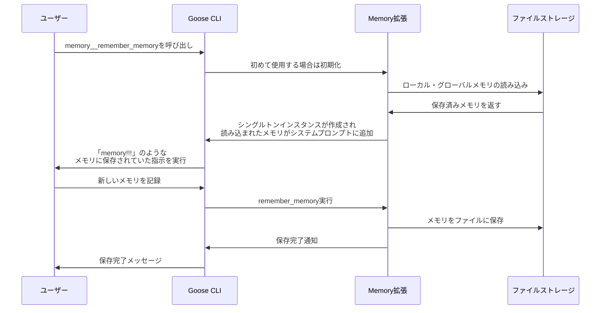
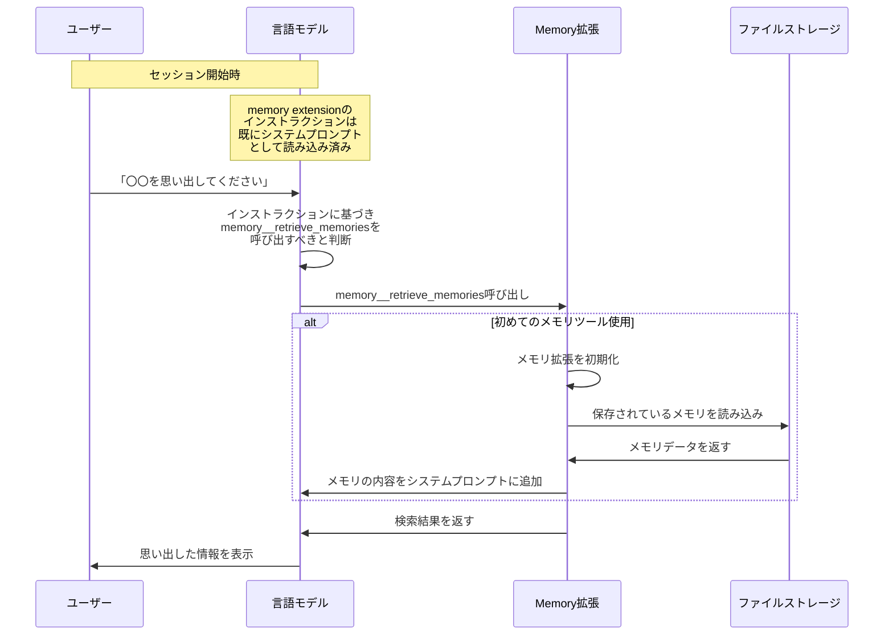

# Gooseのメモリ機能の内部実装と動作原理

## 概要

Gooseのメモリ機能は、ユーザーの重要な情報を保存し、後のセッションで参照できるようにする機能です。この文書では、Gooseのメモリ機能の内部実装と実際の動作原理について詳しく説明します。



## メモリ機能の初期化タイミング

Gooseのメモリ機能は、**起動時には自動的に初期化されない**ことが重要なポイントです。メモリ拡張機能は、以下のいずれかのタイミングで初期化されます：

1. **明示的にMCP経由で起動した場合**:
   ```bash
   goose mcp memory
   ```

2. **セッション開始時に明示的に指定した場合**:
   ```bash
   goose session --with-builtin memory
   ```

3. **メモリ関連ツールを初めて使用した場合**:
   ```
   memory__remember_memory()
   memory__retrieve_memories()
   ```
   などの関数を初めて呼び出したとき

4. **設定ファイルで事前に有効化されていた場合**

## 拡張機能の初期化とインストラクション処理

拡張機能が初期化される際には、内部的に以下のようなプロセスが実行されます：

### 1. Agent側での拡張機能の初期化:

Agentクラスの `add_extension` メソッドが呼び出され、以下の処理が実行されます:

```rust
// Capabilities::add_extension メソッド内の処理
// クライアントをセットアップと初期化
let client = /* 拡張機能のタイプに応じてセットアップ */;

// 初期化処理を実行し、結果を取得
let init_result = client
    .initialize(info, capabilities)
    .await
    .map_err(|e| ExtensionError::Initialization(config.clone(), e))?;

let sanitized_name = normalize(config.key().to_string());

// 重要: 拡張機能が提供するインストラクションを保存
if let Some(instructions) = init_result.instructions {
    println!("!!INSTRUCTIONS!!:\n========\n\n{}\n\n========", &instructions);
    self.instructions
        .insert(sanitized_name.clone(), instructions);
}

// リソース機能をサポートしている場合はそれを記録
if init_result.capabilities.resources.is_some() {
    self.resource_capable_extensions
        .insert(sanitized_name.clone());
}
```

この処理によって:
1. 各拡張機能から返されるインストラクション（使用方法や機能説明など）が保存される
2. 各拡張機能がリソース機能をサポートしているかどうかが記録される
3. 拡張機能のクライアントインスタンスが保存される

### 2. Memory拡張機能の初期化処理:

メモリ拡張機能が初期化されるとき、以下のような処理が実行されます:

```rust
// MemoryRouter::new() メソッド内
let mut memory_router = Self {
    tools: vec![/* ツール定義 */],
    instructions: instructions.clone(),
    global_memory_dir,
    local_memory_dir,
};

// グローバルメモリとローカルメモリを読み込む
let retrieved_global_memories = memory_router.retrieve_all(true);
let retrieved_local_memories = memory_router.retrieve_all(false);

let mut updated_instructions = instructions;

// 読み込んだメモリ内容をインストラクションに追加
if let Ok(global_memories) = retrieved_global_memories {
    if !global_memories.is_empty() {
        updated_instructions.push_str("\n\nGlobal Memories:\n");
        for (category, memories) in global_memories {
            updated_instructions.push_str(&format!("\nCategory: {}\n", category));
            for memory in memories {
                updated_instructions.push_str(&format!("- {}\n", memory));
            }
        }
    }
}

// ローカルメモリも同様に追加
if let Ok(local_memories) = retrieved_local_memories {
    // ... 同様の処理
}

// 更新されたインストラクションを設定
memory_router.set_instructions(updated_instructions);
```

### 3. インストラクション情報のシステムプロンプトへの組み込み:

送信される時、このget_system_promptはagent.replyに毎回呼ばれてることがわかった！
拡張機能のインストラクションは、システムプロンプトの生成時に組み込まれます:

```rust
// capabilities.rs の get_system_prompt() メソッド
async fn get_system_prompt(&self) -> String {
    let mut context: HashMap<&str, Value> = HashMap::new();

    // 拡張機能の情報を収集
    let extensions_info: Vec<ExtensionInfo> = self
        .clients
        .keys()
        .map(|name| {
            let instructions = self.instructions.get(name).cloned().unwrap_or_default();
            let has_resources = self.resource_capable_extensions.contains(name);
            ExtensionInfo::new(name, &instructions, has_resources)
        })
        .collect();
    context.insert("extensions", serde_json::to_value(extensions_info).unwrap());

    // システムプロンプトテンプレートに渡す
    prompt_template::render_global_file("system.md", &context)
        .expect("Prompt should render")
}
```

↓でちゃんとレンダリングされるし、anthropicのAPIに渡される crates/goose/src/providers/formats/anthropic.rs の create_requestに書いてるけど、 { "system": "{{system}}", "tools": "{{tools}}" } } みたいな感じで、systemとtoolsがjsonで渡される。

`system.md` テンプレートでは、これらの情報が以下のように組み込まれます:
```markdown

## {{extension.name}}

{{extension.name}} supports resources, you can use platform__read_resource,
and platform__list_resources on this extension.

### Instructions
{{extension.instructions}}

```

この流れにより、拡張機能のインストラクション（使い方）と保存されたメモリの内容が、LLMに提供されるシステムプロンプトに組み込まれます。

## メモリの読み込みプロセス

`MemoryRouter::new()`が呼び出されると、以下の処理が行われます：

```rust
let retrieved_global_memories = memory_router.retrieve_all(true);
let retrieved_local_memories = memory_router.retrieve_all(false);

// 省略...

// グローバルメモリの追加
if let Ok(global_memories) = retrieved_global_memories {
    if !global_memories.is_empty() {
        updated_instructions.push_str("\n\nGlobal Memories:\n");
        for (category, memories) in global_memories {
            updated_instructions.push_str(&format!("\nCategory: {}\n", category));
            for memory in memories {
                updated_instructions.push_str(&format!("- {}\n", memory));
            }
        }
    }
}

// ローカルメモリの追加
if let Ok(local_memories) = retrieved_local_memories {
    if !local_memories.is_empty() {
        updated_instructions.push_str("\n\nLocal Memories:\n");
        for (category, memories) in local_memories {
            updated_instructions.push_str(&format!("\nCategory: {}\n", category));
            for memory in memories {
                updated_instructions.push_str(&format!("- {}\n", memory));
            }
        }
    }
}
```

この処理により、メモリの内容はシステムプロンプトに追加され、AIモデルが参照できるようになります。

## メモリのストレージ構造

メモリは以下の2つの場所に保存されます：

1. **グローバルメモリ**: ユーザー全体で共有されるメモリ
   - macOS/Linux: `~/.config/goose/memory/`
   - Windows: `~\AppData\Roaming\Block\goose\config\memory`

2. **ローカルメモリ**: プロジェクト固有のメモリ
   - カレントディレクトリの `.goose/memory/`

各カテゴリは別々のMarkdownファイル（`.md`拡張子）として保存されます。

## メモリファイルの形式

メモリファイルは以下の形式で保存されます：

```markdown
# タグ1 タグ2 タグ3
メモリの内容がここに記載されます

# 別のタグ
別のメモリの内容
```

- 行頭が `#` で始まる場合はタグのリスト
- タグ行の次の行からメモリの内容
- 空行でメモリエントリを区切る

## メモリ機能の重要な挙動

1. **初期化タイミング**:
   - メモリ機能は初めて呼び出されたときにのみ初期化される
   - 初期化されると、その時点で保存されているすべてのメモリが読み込まれる

2. **メモリの追加**:
   - 新しいメモリはファイルに追記される
   - 現在のセッションでは、すでに初期化された後に追加されたメモリは自動的にシステムプロンプトに反映されない
   - 次回のセッション（またはメモリ拡張の初期化時）に新しいメモリも含めて読み込まれる

3. **「memory!!!」のような応答**:
   - メモリに「このファイルが読み込まれたら〇〇と言ってください」のような指示がある場合、メモリ拡張が初期化されるタイミングでその指示がシステムプロンプトに含まれる
   - そのため、セッション開始時には表示されないが、メモリ機能を初めて使用したときに突然指示が実行されることがある

## メモリ操作関数

```rust
// メモリの保存
pub fn remember(
    &self,
    _context: &str,
    category: &str,
    data: &str,
    tags: &[&str],
    is_global: bool,
) -> io::Result<()>

// メモリの取得
pub fn retrieve(
    &self,
    category: &str,
    is_global: bool,
) -> io::Result<HashMap<String, Vec<String>>>

// 特定のメモリを削除
pub fn remove_specific_memory(
    &self,
    category: &str,
    memory_content: &str,
    is_global: bool,
) -> io::Result<()>

// カテゴリ全体を削除
pub fn clear_memory(&self, category: &str, is_global: bool) -> io::Result<()>
```

## ツールインターフェース

以下のツールが提供されています：

1. `remember_memory`: カテゴリとタグでメモリを保存
2. `retrieve_memories`: カテゴリからメモリを取得
3. `remove_memory_category`: カテゴリ全体のメモリを削除
4. `remove_specific_memory`: 特定のメモリを削除

## 結論と注意点

1. **重要な理解**: 
   - メモリ拡張機能は自動的には初期化されず、明示的に呼び出されたときに初期化される
   - 初期化時点で、全てのメモリファイルが読み込まれ、システムプロンプトに追加される

2. **予想外の動作**:
   - メモリに特定の指示（「このファイルが読み込まれたら〇〇と言ってください」など）が含まれている場合、その指示はメモリ拡張が初期化されるタイミングで実行される
   - セッション開始時には表示されないが、メモリ機能を初めて使用したときに突然指示が実行されることがある

3. **ベストプラクティス**:
   - 重要なセッションでは、セッション開始時に`--with-builtin memory`を指定することで、メモリを確実に読み込ませる
   - メモリに特殊な指示を保存する場合は、その動作タイミングを理解しておく
   - セッション中に追加したメモリは、次回のセッションまで反映されないことを考慮する

## 「〇〇を思い出してください」の処理フロー

「〇〇を思い出してください」のような命令に対するGooseの処理フローについて詳しく説明します。ここには重要な区別があります：

1. **Extensionのインストラクション読み込み**：
   - メモリ拡張機能が有効化されている場合：セッション開始時
   - メモリ拡張機能が有効化されていない場合：メモリツール初回使用時

2. **メモリの内容の読み込み**：
   - メモリ拡張機能が有効化されている場合：セッション開始時
   - メモリ拡張機能が有効化されていない場合：メモリツール初回使用時

## インストラクション適用の内部実装

Gooseは開始時に拡張機能のインストラクションを読み込み、言語モデルに提供するように実装されています。読み込み後はシステムプロンプトに含まれています。具体的には以下のコード部分が関係しています：

### 1. 拡張機能初期化フロー

`crates/goose-cli/src/session/builder.rs`の`build_session`関数では、セッション開始時に、有効化されている全ての拡張機能が読み込まれます：

```rust
// Setup extensions for the agent
for extension in ExtensionManager::get_all().expect("should load extensions") {
    if extension.enabled {
        let config = extension.config.clone();
        agent
            .add_extension(config.clone())
            .await
            .unwrap_or_else(|e| {
                let err = match e {
                    ExtensionError::Transport(McpClientError::StdioProcessError(inner)) => {
                        inner
                    }
                    _ => e.to_string(),
                };
                println!("Failed to start extension: {}, {:?}", config.name(), err);
                println!("Please check extension configuration for {}.", config.name());
                process::exit(1);
            });
    }
}
```

### 2. インストラクションの保存

`crates/goose/src/agents/capabilities.rs`の`add_extension`メソッドが呼ばれ、拡張機能のインストラクションを保持します：

```rust
// 拡張機能から返されたインストラクションを保存
if let Some(instructions) = init_result.instructions {
    self.instructions
        .insert(sanitized_name.clone(), instructions);
}
```

この処理は以下の流れで行われます:

1. 拡張機能のクライアント (`McpClient`) を作成
2. クライアントの `initialize` メソッドを呼び出し
3. 初期化結果から `instructions` を取得（この中にメモリの内容も含まれる）
4. インストラクションをハッシュマップに保存

### 3. システムプロンプトの生成

`crates/goose/src/agents/capabilities.rs`の`get_system_prompt`メソッドでは、拡張機能のインストラクションを含むシステムプロンプトが作成されます：

```rust
async fn get_system_prompt(&self) -> String {
    let mut context: HashMap<&str, Value> = HashMap::new();

    let extensions_info: Vec<ExtensionInfo> = self
        .clients
        .keys()
        .map(|name| {
            let instructions = self.instructions.get(name).cloned().unwrap_or_default();
            let has_resources = self.resource_capable_extensions.contains(name);
            ExtensionInfo::new(name, &instructions, has_resources)
        })
        .collect();
    context.insert("extensions", serde_json::to_value(extensions_info).unwrap());

    // ...
    
    // システムプロンプトテンプレートに各拡張のインストラクションを渡す
    prompt_template::render_global_file("system.md", &context)
        .expect("Prompt should render")
}
```

### 4. システムプロンプトテンプレート

`crates/goose/src/prompts/system.md`テンプレートでは、拡張機能のインストラクションが以下のようにレンダリングされます：

```markdown

## {{extension.name}}

{{extension.name}} supports resources, you can use platform__read_resource,
and platform__list_resources on this extension.

### Instructions
{{extension.instructions}}

```

このように、memory extensionのインストラクションは、**セッション開始時に**他の拡張機能と同様にシステムプロンプトに読み込まれ、言語モデルに提供されます。これにより、言語モデルは「思い出してください」という問いが来た時から、既にインストラクションに基づき、適切なmemoryツールを呼び出すことができるようになっています。

### リクエスト処理の流れ



### キーワード判断のメカニズム

memory extensionのインストラクションには、以下のようなキーワードトリガーのリストが含まれています：

```
Keywords that trigger memory tools:
- "remember"
- "forget"
- "memory"
- "save"
- "save memory"
- "remove memory"
- "clear memory"
- "search memory"
- "find memory"
```

日本語では「思い出して」「覚えて」「記憶して」などの言葉が、これらのトリガーキーワードに対応します。

### 実際の処理フロー

1. **セッション開始時**：
   - memory extensionが有効化されている場合、そのインストラクション（使い方の説明）はシステムプロンプトの一部として既に読み込まれています
   - メモリ拡張機能が有効な場合、保存されているメモリの内容もインストラクションに含まれて読み込まれます

2. **ユーザーが「〇〇を思い出してください」と入力**：
   - 言語モデル（GPT-4やClaude等）がシステムプロンプトに含まれるmemory extensionのインストラクションを参照
   - 「思い出して」をメモリトリガーキーワードとして認識
   - `memory__retrieve_memories`ツールを呼び出すべきと判断

3. **初めてメモリツールを使用する場合**：
   - もしまだメモリ拡張機能が初期化されていない場合、初期化され、保存されているメモリファイルが読み込まれる
   - 読み込まれたメモリ内容がシステムプロンプトに追加される
   - メモリに「このファイルが読み込まれたら〇〇と言ってください」のような指示があれば、その時点で実行される

4. **メモリ検索の実行**：
   - 指定されたカテゴリ（または全カテゴリ）のメモリが検索される
   - 検索結果が言語モデルに返される

5. **応答の生成**：
   - 言語モデルが検索結果を基に応答を生成
   - ユーザーに思い出した情報を提示

### 重要なポイント

- **2つの異なる読み込み**：
  - **インストラクション**（どう動くべきかの説明）はセッション開始時に読み込まれる
  - **メモリの内容**（保存されていた情報）はメモリ拡張機能が初期化されるタイミングで読み込まれる

- **インストラクションの優先度**：
  - memory extensionのインストラクションは、他のextensionのインストラクションと同様に、言語モデルの行動を導くガイドラインとして機能する
  - 言語モデルは、これらのインストラクションを基に、どのツールを使うべきかを判断する