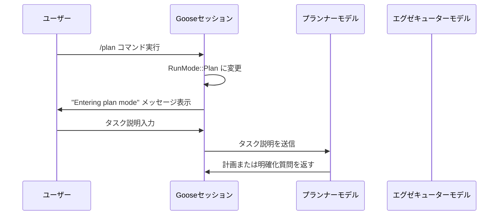
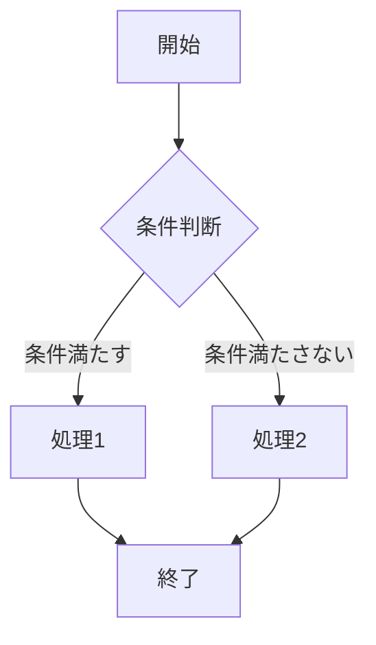
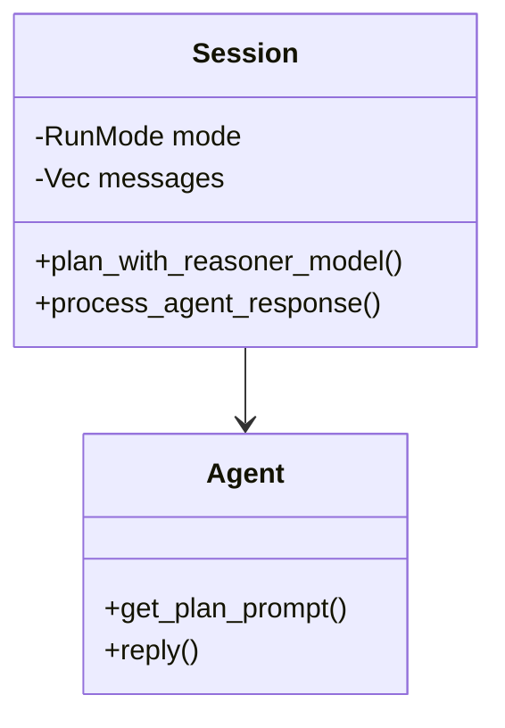
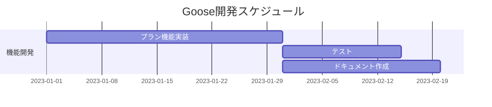
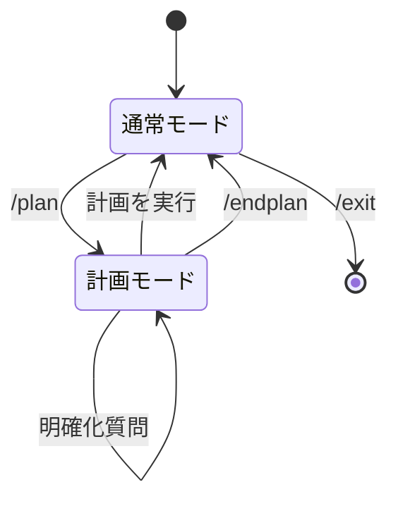

# Gooseにおけるmermaidの表示設定

Gooseのドキュメントでmermaid図を作成する際は、color schemaとして「monokai」を採用します。このドキュメントでは、Gooseでmermaidを使用する際の標準的な設定と使用例を示します。

## 標準設定

Gooseでmermaidを使用する際は、以下のように`%%{init}%%`セクションでmonokaiテーマを指定してください：

````markdown
```mermaid
%%{init: { 'theme': 'monokai' } }%%
// ここにmermaidの図を記述
```
````

## 使用例

### シーケンス図の例

````markdown

````

### フローチャートの例

````markdown

````

### クラス図の例

````markdown

````

### ガントチャートの例

````markdown

````

### 状態遷移図の例

````markdown

````

## monokaiテーマの特徴

monokaiテーマは以下の特徴を持ちます：

- ダークな背景色
- 鮮やかな色のコントラスト
- 長時間見ても目に優しい配色
- コード編集でも人気の高いカラースキーム

## 適用時の注意点

1. GitHub上でmarkdownファイルを閲覧する場合、カスタムテーマが適用されない場合があります
2. ローカルでの表示時と、各種ドキュメントサイトでの表示が異なる場合があります
3. 印刷時には色が適切に出力されるか確認してください

## まとめ

Gooseでドキュメントを作成する際は、mermaid図にmonokaiテーマを適用することで、一貫性のある視覚的な表現を提供します。これにより、Gooseのドキュメント全体の一貫性が向上し、読みやすさが向上します。