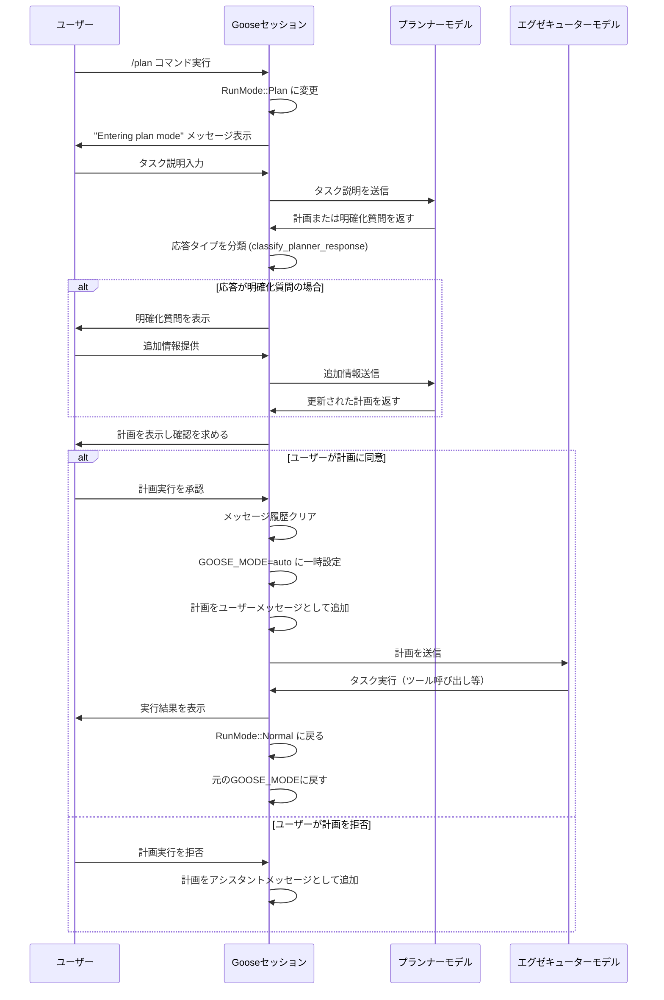

# Gooseのプラン機能解説

## プラン機能の概要

Gooseのプラン機能は、ユーザーが複雑なタスクを実行する際、AIに体系的な計画を立ててもらい、その計画に基づいて実行させるための機能です。この機能は、タスクを2つのフェーズに分割します：

1. **計画フェーズ**: 専用の「プランナー」モデルが詳細なステップバイステップの計画を生成
2. **実行フェーズ**: 「エグゼキューター」モデルが計画に従って実際のタスクを実行

この分離により、AIの実行を制御しながら複雑なタスクを効率的に処理できます。

## プラン機能の流れ



## プラン機能の技術的実装

### コマンドインターフェース

- `/plan [メッセージ]`: プランモードを開始し、オプションでタスク説明を提供
- `/endplan`: プランモードを終了

### 主要なコンポーネント

1. **入力処理 (`input.rs`)**:
   - `parse_plan_command` 関数がプランコマンドを解析
   - `PlanCommandOptions` 構造体に計画用メッセージを格納

2. **セッション管理 (`session/mod.rs`)**:
   - `RunMode` 列挙型で通常モードと計画モードを区別
   - `plan_with_reasoner_model` メソッドが計画作成と実行のメインロジックを処理

3. **プロンプトテンプレート (`plan.md`)**:
   - 「プランナー」としての役割定義
   - 計画作成のガイドライン（明確性、詳細な手順、依存関係明示など）
   - 利用可能なツールのリスト

4. **応答分類（`classify_planner_response`関数）**:
   - 応答が「計画」か「明確化質問」かを判断
   - 応答タイプに基づいて次のアクションを決定

### 計画の実行プロセス

1. ユーザーが計画を承認すると、以下の処理が行われます：
   - 会話履歴がクリアされる（`self.messages.clear()`）
   - Gooseモードが一時的に `auto` に設定される
   - 計画が新しいユーザーメッセージとして追加される
   - `self.process_agent_response(true)` で計画が実行される
   - 実行後、元のGooseモードに戻る

### モデル設定

プラン機能では特定のモデルを使用できます：
- `GOOSE_PLANNER_PROVIDER`: 使用するプロバイダー
- `GOOSE_PLANNER_MODEL`: 使用するモデル

これらが設定されていない場合、通常のGoose設定から標準モデルが使用されます。

## プラン機能の活用シナリオ

プラン機能は以下のようなシナリオで特に効果的です：

1. **複雑なタスクの体系化**:
   - 多段階のビルドプロセス
   - データ収集・分析・レポート生成の一連の流れ
   - 複数のシステムやツールにまたがる操作

2. **探索的タスク**:
   - 未知の問題へのアプローチ設計
   - 代替手法の比較検討
   - 課題の分解と調査計画

3. **反復的なプロセス**:
   - 標準的なワークフローの自動化
   - 定期的なメンテナンスタスク
   - 品質保証チェックの実行

## ベストプラクティス

1. **準備**:
   - プラン機能を使用する前に `/mode approve` を設定することを推奨
   - 計画に必要なコンテキストを事前にGooseに提供する

2. **計画の詳細度**:
   - 具体的な目標を明確に提示
   - 制約条件や優先事項を明示する
   - 計画が不十分な場合は追加情報を提供する

3. **実行時の対応**:
   - 計画実行中に問題が発生した場合は `Ctrl+C` で中断可能
   - 計画を修正してから再実行することも可能

## 内部実装の詳細

### プランナーモデルの取得

```rust
fn get_reasoner() -> Result<Box<dyn Provider + Send + Sync>, anyhow::Error> {
    // 環境変数からプランナーの設定を取得、またはデフォルト設定を使用
    let (reasoner_provider, reasoner_model) = match (
        std::env::var("GOOSE_PLANNER_PROVIDER"),
        std::env::var("GOOSE_PLANNER_MODEL"),
    ) {
        (Ok(provider), Ok(model)) => (provider, model),
        _ => {
            // デフォルト設定を使用
            let config = Config::global();
            let provider = config.get_param("GOOSE_PROVIDER").expect("No provider configured");
            let model = config.get_param("GOOSE_MODEL").expect("No model configured");
            (provider, model)
        }
    };

    // プロバイダーとモデルでリーズナーを作成
    let model_config = ModelConfig::new(reasoner_model);
    let reasoner = create(&reasoner_provider, model_config)?;

    Ok(reasoner)
}
```

### 計画プロンプトの取得

プラン機能では、特殊なプロンプトテンプレートを使用します：

```rust
async fn get_plan_prompt(&self) -> anyhow::Result<String> {
    let mut capabilities = self.capabilities.lock().await;
    let tools = capabilities.get_prefixed_tools().await?;
    let tools_info = tools
        .into_iter()
        .map(|tool| ToolInfo::new(&tool.name, &tool.description, get_parameter_names(&tool)))
        .collect();

    let plan_prompt = capabilities.get_planning_prompt(tools_info).await;

    Ok(plan_prompt)
}
```

## まとめ

Gooseのプラン機能は、複雑なタスクをAIに効率的に実行させるための優れた仕組みです。計画と実行を分離することで、ユーザーはAIの行動をより制御しやすくなり、複雑な操作も体系的に処理できます。また、会話コンテキストをクリアして計画だけに集中させる設計により、実行の確実性が高まります。

この機能を活用することで、ユーザーはより高度で複雑なタスクをGooseに任せることができるようになり、AIアシスタントとしての実用性が大幅に向上します。