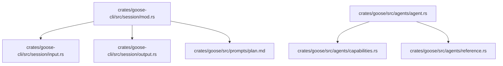

# Gooseプラン機能の関連ファイル構造

このドキュメントでは、Gooseのプラン機能に関連する主要なファイルとその役割について説明します。プラン機能はGooseのコードベース内の様々な場所に実装が分散しており、この全体像を理解することで機能の仕組みをより深く把握できます。

## プラン機能の動作概要

Gooseのプラン機能は「planner」と「executor」の2つのエージェントが連携して動作します：

1. **planner**（計画立案者）: 専用の`plan.md`プロンプトに従って動作し、ユーザーの要求を分析して実行可能な計画を作成するか、情報が不足している場合は明確化質問を生成します。

2. **executor**（実行者）: 通常のGooseエージェントとして`system.md`のシステムプロンプトに従って動作します。plannerが作成した計画は「ユーザーメッセージ」として扱われ、executorはそれを指示として実行します。

プラン機能の実行フローは以下の通りです：

1. ユーザーが`/plan`コマンドで指示を出す
2. システムがプランモードに切り替わり、plannerが起動
3. plannerが指示を分析し、計画または明確化質問を提案
4. 明確化質問の場合：質問が会話に追加され、ユーザーが回答を提供
5. 計画の場合：ユーザーが計画を承認すると以下が実行される
   - 会話履歴がクリアされる
   - 計画内容がユーザーメッセージとして追加される
   - Gooseモードが一時的に「auto」に設定される
   - executorが計画を実行する

重要な点として、executorには特別なプロンプトファイルは存在せず、通常のGooseシステムプロンプト（`system.md`）に従って動作します。executorにとってplannerの計画は「ユーザーからの指示」として扱われるため、特別な対応は不要です。

## コアファイル



### 1. セッション管理関連ファイル

#### `crates/goose-cli/src/session/mod.rs`

プラン機能の中核となるファイルで、以下の主要な実装が含まれています：

- `RunMode` 列挙型: 通常モードと計画モードを区別
- `plan_with_reasoner_model` メソッド: 計画作成と実行のメインロジックを処理
- `classify_planner_response` 関数: 応答が「計画」か「明確化質問」かを判断

最も重要な部分は `plan_with_reasoner_model` メソッドで、このメソッドがプランナーモデルとのやり取りや計画実行の流れを制御しています。

```rust
async fn plan_with_reasoner_model(
    &mut self,
    plan_messages: Vec<Message>,
    reasoner: Box<dyn Provider + Send + Sync>,
) -> Result<(), anyhow::Error> {
    // プランプロンプトの取得
    let plan_prompt = self.agent.get_plan_prompt().await?;
    // プランナーモデルに計画作成を要求
    let (plan_response, _usage) = reasoner.complete(&plan_prompt, &plan_messages, &[]).await?;
    // 応答の表示
    output::render_message(&plan_response, self.debug);
    // 応答タイプの分類
    let planner_response_type =
        classify_planner_response(plan_response.as_concat_text(), self.agent.provider().await)
            .await?;

    // 応答タイプに基づく処理
    match planner_response_type {
        PlannerResponseType::Plan => {
            // ユーザーに計画実行の確認
            let should_act = cliclack::confirm("Do you want to clear message history & act on this plan?")
                .initial_value(true)
                .interact()?;
            if should_act {
                // 計画実行のためのセットアップと実行
                // ...
            } else {
                // 計画を会話に追加
                self.messages.push(plan_response);
            }
        }
        PlannerResponseType::ClarifyingQuestions => {
            // 明確化質問を会話に追加
            self.messages.push(plan_response);
        }
    }

    Ok(())
}
```

#### `crates/goose-cli/src/session/input.rs`

ユーザー入力、特に `/plan` コマンドの処理を担当します：

- `InputResult::Plan` 列挙値: プラン命令の結果を表現
- `PlanCommandOptions` 構造体: プラン命令のオプションを保持
- `parse_plan_command` 関数: ユーザー入力からプラン命令を解析

```rust
#[derive(Debug)]
pub struct PlanCommandOptions {
    pub message_text: String,
}

fn parse_plan_command(input: String) -> Option<InputResult> {
    let options = PlanCommandOptions {
        message_text: input.trim().to_string(),
    };

    Some(InputResult::Plan(options))
}
```

#### `crates/goose-cli/src/session/output.rs`

プラン機能のユーザーインターフェース表示を担当します：

- `render_enter_plan_mode` 関数: プランモード開始時のメッセージ表示
- `render_act_on_plan` 関数: 計画実行時のメッセージ表示
- `render_exit_plan_mode` 関数: プランモード終了時のメッセージ表示

```rust
pub fn render_enter_plan_mode() {
    println!(
        "\n{} {}\n",
        style("Entering plan mode.").green().bold(),
        style("You can provide instructions to create a plan and then act on it. To exit early, type /endplan")
            .green()
            .dim()
    );
}

pub fn render_act_on_plan() {
    println!(
        "\n{}\n",
        style("Exiting plan mode and acting on the above plan")
            .green()
            .bold(),
    );
}

pub fn render_exit_plan_mode() {
    println!("\n{}\n", style("Exiting plan mode.").green().bold());
}
```

### 2. エージェント関連ファイル

#### `crates/goose/src/agents/agent.rs`

エージェントの基本的なインターフェースを定義します：

- `Agent` トレイト: プラン機能を含むエージェントの基本機能を定義
- `get_plan_prompt` メソッド: エージェントがプランプロンプトを提供するためのインターフェース

```rust
#[async_trait]
pub trait Agent: Send + Sync {
    // ...その他のメソッド...

    /// Get the plan prompt, which will be used with the planner (reasoner) model
    async fn get_plan_prompt(&self) -> anyhow::Result<String>;

    // ...その他のメソッド...
}
```

#### `crates/goose/src/agents/capabilities.rs`

エージェントの機能を提供するクラスです：

- `get_planning_prompt` メソッド: プランプロンプトの生成を担当
- 利用可能なツール情報の収集

```rust
pub async fn get_planning_prompt(&self, tools_info: Vec<ToolInfo>) -> String {
    let mut context: HashMap<&str, Value> = HashMap::new();
    context.insert("tools", serde_json::to_value(tools_info).unwrap());

    prompt_template::render_global_file("plan.md", &context).expect("Prompt should render")
}
```

#### `crates/goose/src/agents/reference.rs`

リファレンス実装のエージェントで、プラン機能の実装を含みます：

- `get_plan_prompt` メソッドの実装: 実際のプランプロンプト生成

```rust
async fn get_plan_prompt(&self) -> anyhow::Result<String> {
    let mut capabilities = self.capabilities.lock().await;
    let tools = capabilities.get_prefixed_tools().await?;
    let tools_info = tools
        .into_iter()
        .map(|tool| ToolInfo::new(&tool.name, &tool.description, get_parameter_names(&tool)))
        .collect();

    let plan_prompt = capabilities.get_planning_prompt(tools_info).await;

    Ok(plan_prompt)
}
```

### 3. プロンプトテンプレート

#### `crates/goose/src/prompts/plan.md`

プランナーモデルへのプロンプトテンプレートを提供します：

- 「プランナー」AIとしての役割定義
- 利用可能なツールのリスト
- 計画作成に関するガイドライン

```markdown
You are a specialized "planner" AI. Your task is to analyze the user's request from the chat messages and create either:
1. A detailed step-by-step plan (if you have enough information) on behalf of user that another "executor" AI agent can follow, or
2. A list of clarifying questions (if you do not have enough information) prompting the user to reply with the needed clarifications

 ## Available Tools

**{{tool.name}}**
Description: {{tool.description}}
Parameters: {{tool.parameters}}



No tools are defined.

## Guidelines
1. Check for clarity and feasibility
  - If the user's request is ambiguous, incomplete, or requires more information, respond only with all your clarifying questions in a concise list.
  - If available tools are inadequate to complete the request, outline the gaps and suggest next steps or ask for additional tools or guidance.
2. Create a detailed plan
  - Once you have sufficient clarity, produce a step-by-step plan that covers all actions the executor AI must take.
  - Number the steps, and explicitly note any dependencies between steps (e.g., "Use the output from Step 3 as input for Step 4").
  - Include any conditional or branching logic needed (e.g., "If X occurs, do Y; otherwise, do Z").
3. Provide essential context
  - The executor AI will see only your final plan (as a user message) or your questions (as an assistant message) and will not have access to this conversation's full history.
  - Therefore, restate any relevant background, instructions, or prior conversation details needed to execute the plan successfully.
4. One-time response
  - You can respond only once.
  - If you respond with a plan, it will appear as a user message in a fresh conversation for the executor AI, effectively clearing out the previous context.
  - If you respond with clarifying questions, it will appear as an assistant message in this same conversation, prompting the user to reply with the needed clarifications.
5. Keep it action oriented and clear
  - In your final output (whether plan or questions), be concise yet thorough.
  - The goal is to enable the executor AI to proceed confidently, without further ambiguity.
```

#### `crates/goose/src/prompts/system.md`

Executorエージェントが使用する標準のシステムプロンプトです。Gooseの通常の会話モードでも使われる同じプロンプトがexecutorにも使用されます：

- Gooseの一般的な目的とアイデンティティの記述
- 現在の日時情報
- 使用できる拡張機能とツールの情報
- 応答ガイドラインとマークダウン形式の指示

重要な点として、plannerが生成した計画はユーザーメッセージとして扱われ、executorは標準のGooseエージェントとして、通常のシステムプロンプトに従いながらその計画を実行します。executorには特別に計画実行用のプロンプトは用意されていません。

## プラン機能の内部動作の詳細

プラン機能の動作において特に重要な点をさらに掘り下げます：

### Plannerプロンプトの設計意図

`plan.md`プロンプトに含まれる「If you respond with a plan, it will appear as a user message in a fresh conversation for the executor AI, effectively clearing out the previous context.」（計画で応答する場合、それは実行者AIの新しい会話でユーザーメッセージとして表示され、実質的に以前のコンテキストはクリアされます）という一文は非常に重要な役割を果たしています。

この指示は、plannerに「あなたの出力がどのように処理されるか」を明確に伝え、以下の効果をもたらします：

1. **自己完結した計画の作成促進**：
   - plannerはexecutorが過去の会話履歴にアクセスできないことを理解
   - 計画に必要な全ての背景情報を含めるよう促される

2. **コンテキスト認識による計画の質向上**：
   - plannerはシステムの挙動を理解した上で出力を最適化できる
   - 「このRustプロジェクトの依存関係をグラフ化する」のように、会話から得た重要な文脈を計画に含めることができる

### 会話履歴とプラン情報の実際の処理

`plan_with_reasoner_model`メソッドの実装には、会話履歴とプラン情報の処理について重要な点があります：

```rust
// 計画が承認された場合
if should_act {
    // ...
    // 会話履歴をクリア
    self.messages.clear();
    // 計画をユーザーメッセージとして追加
    let plan_message = Message::user().with_text(plan_response.as_concat_text());
    self.messages.push(plan_message);
    // 計画に基づいて処理
    self.process_agent_response(true).await?;
    // ...
}
```

この実装から、以下の重要な点が明らかになります：

1. **会話履歴はクリアされるが、計画情報は保持される**：
   - `self.messages.clear()`で全ての過去の会話がクリアされる
   - しかし、plannerが生成した計画は`plan_response`として保持され、ユーザーメッセージとして新しい会話に追加される

2. **Executorの情報源**：
   - Executorはこの単一の「ユーザーメッセージとして追加された計画」のみを情報源として実行する
   - 計画はユーザーからの指示として扱われるため、特別な対応なしに標準のGooseエージェントフローで処理できる

### この設計の利点

この設計には以下のような利点があります：

1. **情報の整理と集中**：
   - 計画実行時に不要な過去の会話ノイズを排除
   - 計画だけを情報源とすることで、executorの集中力と正確性を向上

2. **標準フローとの統合**：
   - 計画をユーザーメッセージとして扱うことで、既存のGooseエージェント処理フローをそのまま利用可能
   - executorに特別なプロンプトや実装が不要になり、システムがシンプルになる

3. **情報フローの最適化**：
   - ユーザー → planner → executor という明確な情報フローが確立される
   - plannerが計画に必要なすべての情報を含めるよう促されることで、情報伝達の損失が最小化

### 日本語によるプラン機能の拡張

プラン機能は多言語対応も可能です。`crates/goose/src/prompts/plan-ja.md`に日本語版のプランナープロンプトを実装することで、日本語環境でのプラン機能が改善されます。

```markdown
あなたは専門の「プランナー」AIです。あなたの任務は、チャットメッセージからユーザーの要求を分析し、以下のいずれかを作成することです：
1. 別の「実行者（executor）」AIエージェントが従うことができる、ユーザーに代わって作成された詳細なステップバイステップの計画（十分な情報がある場合）、または
2. 必要な説明を求めてユーザーに回答を促す、明確化のための質問リスト（十分な情報がない場合）
...
```

実際のプロンプト選択は、システム設定や言語設定に応じて行うことができます。

## 関連ファイルの相互作用

プラン機能は上記のファイルが連携して動作します：

1. `input.rs` がユーザーコマンド「/plan」を解析
2. `session/mod.rs` の `RunMode` が計画モードに変更され、`plan_with_reasoner_model` が呼び出される
3. エージェントの `get_plan_prompt` メソッドが `plan.md` テンプレートを利用してプロンプトを生成
4. プランナーモデルが応答を生成し、`classify_planner_response` が応答をカテゴライズ
5. 計画が承認されると、会話履歴がクリアされ、計画がユーザーメッセージとして追加される
6. 通常のエージェントフローでこの計画が実行される

## 環境変数による設定

```
GOOSE_PLANNER_PROVIDER    プランナーに使用するプロバイダー（OpenAI、Anthropicなど）
GOOSE_PLANNER_MODEL       プランナーに使用するモデル（GPT-4、Claudeなど）
```

これらの環境変数が設定されていない場合、通常のGoose設定から標準プロバイダーとモデルが使用されます。

## ファイル間の依存関係

プラン機能は広範なコードベースにまたがっているため、変更を加える際には複数のファイルに影響する可能性があります。特に以下の依存関係に注意が必要です：

1. `session/mod.rs` がエージェントの `get_plan_prompt` メソッドに依存
2. エージェントの実装が `capabilities.rs` の `get_planning_prompt` に依存
3. `get_planning_prompt` が `plan.md` テンプレートに依存

これらの依存関係を理解することで、機能の変更や拡張を適切に行うことができます。