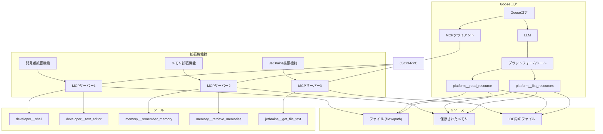
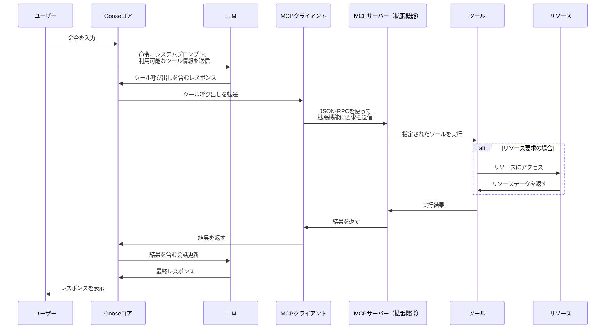

# Gooseのリソースシステムとプラットフォームツール - MCPアーキテクチャ

このドキュメントでは、Gooseのリソースシステムとモデルコンテキストプロトコル（Model Context Protocol、MCP）アーキテクチャについて詳細に説明します。

## MCPアーキテクチャの概要

モデルコンテキストプロトコル（Model Context Protocol、MCP）は、Gooseのメインアプリケーションと様々な拡張機能間の通信を可能にする基本コンポーネントです。MCPは以下のような標準化された方法を提供します：

1. 拡張機能のケイパビリティをツールとして定義する
2. ユーザーの命令を処理して、適切な拡張機能とツールを選択する
3. ツール呼び出しを実行し、結果を会話フローに戻す

### MCP通信フロー

MCPアーキテクチャはクライアント・サーバーモデルに従っています：

1. **MCPサーバー**: 各拡張機能はMCPサーバーとして実行され、ツールと機能を提供します
2. **MCPクライアント**: Gooseのメインアプリケーションは各拡張機能へのクライアント接続を維持します
3. **JSON-RPCプロトコル**: クライアントとサーバー間の通信はJSON-RPCメッセージを使用します

```
ユーザー入力 → Gooseコア → LLM → ツール選択 → MCPクライアント → MCPサーバー（拡張機能） → ツール実行
```

### MCPサーバーの実装方法

MCPサーバーは次の3つの方法で実装できます：

1. **組み込み型**: Gooseバイナリに埋め込まれた拡張機能
   - 別プロセスとして実行されますが、同じ実行可能ファイルを使用します
   - 標準入出力を介した通信

2. **標準入出力型**: 標準入出力を介して通信する外部拡張機能
   - どの言語でも実装可能
   - 子プロセスとして実行

3. **サーバー送信イベント（SSE）型**: RESTful HTTPエンドポイント
   - 異なるマシンで実行できるリモート拡張機能
   - HTTPストリーミングを介した通信

## リソースシステムの概要

Gooseのリソースシステムは、拡張機能が様々なデータをLLMに提供するための統一的な仕組みです。これにより、以下のような情報を簡単にLLMのコンテキストに取り込むことができます：

- ファイルの内容
- データベースのスキーマ
- アプリケーション固有の情報
- その他の構造化データ

リソースは、拡張機能と言語モデル間の情報交換の基本単位です。

## リソースの構造

各リソースは以下の主要な構成要素を持ちます：

```rust
pub struct Resource {
    /// URI representing the resource location (e.g., "file:///path/to/file" or "str:///content")
    pub uri: String,
    /// Name of the resource
    pub name: String,
    /// Optional description of the resource
    pub description: Option<String>,
    /// MIME type of the resource content ("text" or "blob")
    pub mime_type: String,
    pub annotations: Option<Annotations>,
}
```

- **URI**: リソースの場所を示す一意の識別子
- **名前**: リソースの名前（表示用）
- **MIMEタイプ**: リソースの種類（主に「text」または「blob」）
- **優先度**: リソースの重要性（0.0〜1.0の値、annotationsに含まれる）
- **タイムスタンプ**: リソースの最終更新時刻（annotationsに含まれる）

## ツール選択プロセス

ユーザーがGooseに命令を出すと、システムは拡張機能とツールを決定するために2段階のプロセスを実行します：

### ステージ1: LLMベースのツール選択

1. **ツール情報収集**:
   - Gooseは`capabilities.get_prefixed_tools()`を通じて、すべてのアクティブな拡張機能から利用可能なツールを収集します
   - 各ツールには拡張機能名が接頭辞として付けられます（例: `developer__shell`）
   - ツールには名前、説明、パラメータスキーマが含まれます

2. **LLM処理**:
   - ユーザーの命令、システムプロンプト、ツール情報は`provider().complete(...)`を通じてLLMに渡されます
   - LLMは命令を分析し、最も適切なツールを決定します
   - プロバイダー固有のフォーマットコンバーター（例: `google.rs`, `openai.rs`）がAPI固有のフォーマットを処理します

3. **レスポンス解析**:
   - LLMのレスポンスはプロバイダー固有のパーサー（例: `response_to_message()`）によって処理されます
   - LLMがツールを使用すると判断した場合、そのレスポンスにツール呼び出しが含まれます
   - これはツール名と引数を持つ`MessageContent::ToolRequest`に変換されます

LLMのツール呼び出しを変換するコード例:

**Google AI の場合:**

```rust
if let Some(function_call) = part.get("functionCall") {
    let id = generate_random_id();
    let name = function_call["name"].as_str().unwrap_or_default().to_string();
    
    if !is_valid_function_name(&name) {
        // 無効な関数名の処理
    } else {
        if let Some(params) = function_call.get("args") {
            content.push(MessageContent::tool_request(
                id,
                Ok(ToolCall::new(&name, params.clone())),
            ));
        }
    }
}
```

**GCP Vertex AI (Gemini) の場合:**

```rust
// GCP Vertex AIでは、モデルに応じて異なる処理が必要
pub fn response_to_message(response: Value, request_context: RequestContext) -> Result<Message> {
    match request_context.provider() {
        // Geminiモデルの場合はGoogleの実装を使用
        ModelProvider::Google => {
            let mut content = Vec::new();
            let binding = vec![];
            let candidates: &Vec<Value> = response
                .get("candidates")
                .and_then(|v| v.as_array())
                .unwrap_or(&binding);
            let candidate = candidates.first();
            let role = Role::Assistant;
            let created = chrono::Utc::now().timestamp();
            
            if candidate.is_none() {
                return Ok(Message {
                    role,
                    created,
                    content,
                });
            }
            
            let candidate = candidate.unwrap();
            let parts = candidate
                .get("content")
                .and_then(|content| content.get("parts"))
                .and_then(|parts| parts.as_array())
                .unwrap_or(&binding);

            for part in parts {
                if let Some(text) = part.get("text").and_then(|v| v.as_str()) {
                    content.push(MessageContent::text(text.to_string()));
                } else if let Some(function_call) = part.get("functionCall") {
                    // ランダムなIDを生成
                    let id: String = rand::thread_rng()
                        .sample_iter(&Alphanumeric)
                        .take(8)
                        .map(char::from)
                        .collect();
                    
                    // 関数名を取得
                    let name = function_call["name"]
                        .as_str()
                        .unwrap_or_default()
                        .to_string();
                    
                    // 関数名が有効か検証
                    if !is_valid_function_name(&name) {
                        let error = mcp_core::ToolError::NotFound(format!(
                            "関数名 '{}' に無効な文字が含まれています。[a-zA-Z0-9_-]+ の正規表現に一致する必要があります",
                            name
                        ));
                        content.push(MessageContent::tool_request(id, Err(error)));
                    } else {
                        // 引数を取得して処理
                        if let Some(params) = function_call.get("args") {
                            content.push(MessageContent::tool_request(
                                id,
                                Ok(ToolCall::new(&name, params.clone())),
                            ));
                        }
                    }
                }
            }
            Ok(Message {
                role,
                created,
                content,
            })
        },
        // Anthropicモデルの場合はAnthropicの実装を使用
        ModelProvider::Anthropic => anthropic::response_to_message(response),
    }
}
```

### ステージ2: MCPクライアント/ツール解決

LLMが使用するツールを特定した後、Gooseはどの拡張機能がそのツールを処理するかを決定する必要があります：

1. **拡張機能の識別**:
   - `capabilities.rs`の`dispatch_tool_call`メソッドはツール呼び出しを処理します
   - ツール名の接頭辞を使用して、どの拡張機能が呼び出しを処理すべきかを識別します
   - `get_client_for_tool`メソッドは一致するMCPクライアントを検索します：

```rust
fn get_client_for_tool(&self, prefixed_name: &str) -> Option<(&str, McpClientBox)> {
    self.clients
        .iter()
        .find(|(key, _)| prefixed_name.starts_with(*key))
        .map(|(name, client)| (name.as_str(), Arc::clone(client)))
}
```

2. **ツール名の抽出**:
   - 拡張機能が識別されると、拡張機能固有のツール名が抽出されます：

```rust
let tool_name = tool_call
    .name
    .strip_prefix(client_name)
    .and_then(|s| s.strip_prefix("__"))
    .ok_or_else(|| ToolError::NotFound(tool_call.name.clone()))?;
```

3. **ツール実行**:
   - 識別されたMCPクライアントは特定のツールを呼び出すために使用されます
   - LLMからのパラメータがツールに渡されます

```rust
let client_guard = client.lock().await;
client_guard
    .call_tool(tool_name, tool_call.clone().arguments)
    .await
    .map(|result| result.content)
    .map_err(|e| ToolError::ExecutionError(e.to_string()))
```

## プラットフォームツール

Gooseには、リソースシステムにアクセスするための特別なツールが組み込まれています：

### platform__read_resource

```json
{
  "name": "platform__read_resource",
  "description": "Read a resource from an extension.\n\nResources allow extensions to share data that provide context to LLMs, such as\nfiles, database schemas, or application-specific information. This tool searches for the\nresource URI in the provided extension, and reads in the resource content. If no extension\nis provided, the tool will search all extensions for the resource.\n",
  "parameters": {
    "type": "object",
    "required": ["uri"],
    "properties": {
      "uri": {"type": "string", "description": "Resource URI"},
      "extension_name": {"type": "string", "description": "Optional extension name"}
    }
  }
}
```

このツールは特定のURIに対応するリソースの内容を読み取ります。`extension_name`パラメータが指定されていない場合は、すべての拡張機能から指定されたURIのリソースを検索します。

### platform__list_resources

```json
{
  "name": "platform__list_resources",
  "description": "List resources from an extension(s).\n\nResources allow extensions to share data that provide context to LLMs, such as\nfiles, database schemas, or application-specific information. This tool lists resources\nin the provided extension, and returns a list for the user to browse. If no extension\nis provided, the tool will search all extensions for the resource.\n",
  "parameters": {
    "type": "object",
    "properties": {
      "extension_name": {"type": "string", "description": "Optional extension name"}
    }
  }
}
```

このツールは利用可能なリソースの一覧を取得します。`extension_name`パラメータが指定されていない場合は、すべての拡張機能のリソース一覧を返します。

## MCPとリソースシステムの関係

リソースシステムはMCP（Model Context Protocol）の主要な機能の一つとして実装されています。これにより、拡張機能はLLMに対して構造化された方法でデータを提供できます。

### MCPサーバーのリソース機能実装

MCPサーバーは、初期化時に以下のようにリソース機能のサポートを宣言します：

```rust
fn capabilities(&self) -> ServerCapabilities {
    CapabilitiesBuilder::new()
        .with_resources(true, true)  // リソース機能をサポート
        .build()
}
```

リソース機能をサポートする拡張機能は、以下のインターフェースを実装する必要があります：

```rust
fn list_resources(&self) -> Vec<mcp_core::resource::Resource>;
fn read_resource(
    &self,
    uri: &str,
) -> Pin<Box<dyn Future<Output = Result<String, ResourceError>> + Send + 'static>>;
```

### リソース機能の処理フロー

`capabilities.rs`ファイルでは、`read_resource`および`list_resources`メソッドが実装されており、これらがLLMモデルから直接呼び出されるプラットフォームツールとマッピングされています：

```rust
async fn read_resource(&self, params: Value) -> Result<Vec<Content>, ToolError> {
    let uri = params
        .get("uri")
        .and_then(|v| v.as_str())
        .ok_or_else(|| ToolError::InvalidParameters("Missing 'uri' parameter".to_string()))?;

    let extension_name = params.get("extension_name").and_then(|v| v.as_str());
    
    // 実装詳細...
}

async fn list_resources(&self, params: Value) -> Result<Vec<Content>, ToolError> {
    let extension = params.get("extension").and_then(|v| v.as_str());
    
    // 実装詳細...
}
```

## リソースシステムの使用例

### アクティブな拡張機能のリソース一覧取得

```json
{"name": "platform__list_resources", "arguments": {}}
```

### 特定の拡張機能のリソース一覧取得

```json
{"name": "platform__list_resources", "arguments": {"extension_name": "jetbrains"}}
```

### ファイルリソースの読み取り

```json
{"name": "platform__read_resource", "arguments": {"uri": "file:///path/to/project/file.py", "extension_name": "jetbrains"}}
```

## 処理フロー例

ユーザーがGooseにリソースを要求した場合の全体的な処理フロー：

1. ユーザーが入力: 「このプロジェクトのpackage.jsonファイルを表示して」
2. LLMがこのリクエストを分析し、`platform__read_resource`ツールを使用することを決定
3. LLMレスポンスにツール呼び出しが含まれる: `{name: "platform__read_resource", args: {uri: "file:///path/to/package.json", extension_name: "developer"}}`
4. Gooseはこのレスポンスを処理し、ツールリクエストを抽出
5. `dispatch_tool_call`が特別処理を行う:
   - `platform__read_resource`はプラットフォームツールとして認識される
   - `read_resource`メソッドが呼び出される
   - 指定されたURI（ここでは「file:///path/to/package.json」）が検索される
6. リソースが見つかった場合、その内容が返される
7. 結果は`ToolResponse`として会話に追加される
8. ツール結果を含めて会話が継続

## リソース対応拡張機能の例

以下の拡張機能はリソースシステムを実装しています：

1. **developer**: プロジェクトファイルや環境情報を提供
2. **memory**: Gooseの永続的な記憶を提供
3. **jetbrains**: IDE内のプロジェクト情報やコードファイルを提供
4. **computercontroller**: ローカルコンピューターのファイルやリソースへのアクセスを提供

## システムプロンプトでの表示

リソース機能をサポートする拡張機能がある場合、システムプロンプトには以下のように明記されます：

```markdown
## jetbrains
jetbrains supports resources, you can use platform__read_resource,
and platform__list_resources on this extension.

### Instructions
JetBrains IDE integration
```

## リソースの優先度とアクティブリソース

リソースには0.0から1.0の優先度があり、1.0の優先度を持つリソースは「アクティブ」とみなされます。アクティブなリソースは自動的にLLMのコンテキストに含まれます。

```rust
// Check if the resource is active
pub fn is_active(&self) -> bool {
    if let Some(priority) = self.priority() {
        (priority - 1.0).abs() < EPSILON
    } else {
        false
    }
}
```

## MCPアーキテクチャの利点

1. **モジュール性**: 拡張機能は独立して開発・展開可能
2. **柔軟性**: 拡張機能はどの言語でも実装可能
3. **セキュリティ**: 拡張機能は制御された通信を持つ別プロセスとして実行
4. **一貫性**: すべてのツール操作のための標準化されたプロトコル
5. **発見可能性**: LLMは説明に基づいてツールを発見して使用可能

## まとめ

Gooseのリソースシステムは、MCP（Model Context Protocol）アーキテクチャを活用して、拡張機能から言語モデルへの効率的なデータ提供を実現しています。`platform__read_resource`と`platform__list_resources`ツールを通じて、LLMはこれらのリソースに簡単にアクセスでき、拡張機能側は標準化されたインターフェースを実装するだけでリソース機能を提供できます。

このアーキテクチャにより、Gooseはコアシステムとその拡張機能の間にクリーンな分離を維持しながら、ファイルシステム、データベース、IDEのプロジェクトなど、様々なデータソースに接続できます。これにより、ユーザーのリクエストに対してより知識を持ったインテリジェントな応答を生成することが可能になります。

# Gooseのツール管理メカニズム解析

Gooseフレームワークでは、`get_prefixed_tools`メソッドとその周辺の処理が、AIモデルに提供するツールを管理する重要な役割を果たしています。この文書では、Gooseがどのようにツールを収集し、フィルタリングしているかを詳細に解説します。

## ツール収集の基本プロセス

`capabilities.rs`の`get_prefixed_tools`メソッドは、以下のように実装されています：

```rust
pub async fn get_prefixed_tools(&mut self) -> ExtensionResult<Vec<Tool>> {
    let mut tools = Vec::new();
    for (name, client) in &self.clients {
        let client_guard = client.lock().await;
        let mut client_tools = client_guard.list_tools(None).await?;

        loop {
            for tool in client_tools.tools {
                tools.push(Tool::new(
                    format!("{}__{}", name, tool.name),
                    &tool.description,
                    tool.input_schema,
                ));
            }

            // exit loop when there are no more pages
            if client_tools.next_cursor.is_none() {
                break;
            }

            client_tools = client_guard.list_tools(client_tools.next_cursor).await?;
        }
    }
    Ok(tools)
}
```

このメソッドは、**登録されているすべての拡張機能（クライアント）からすべてのツールを収集し**、拡張機能名をプレフィックスとして追加したリストを返します。

## ツールのフィルタリングと拡張

しかし、実際には各Agent実装（`TruncateAgent`や`SummarizeAgent`など）の`reply`メソッド内で、特定の条件に基づいてツールが追加または除外されます。

TruncateAgentの`reply`メソッドの先頭部分で以下の処理が行われています：

```rust
async fn reply(
    &self,
    messages: &[Message],
    session: Option<SessionConfig>,
) -> anyhow::Result<BoxStream<'_, anyhow::Result<Message>>> {
    let mut messages = messages.to_vec();
    let reply_span = tracing::Span::current();
    let mut capabilities = self.capabilities.lock().await;
    let mut tools = capabilities.get_prefixed_tools().await?;
    let mut truncation_attempt: usize = 0;

    // Load settings from config
    let config = Config::global();
    let goose_mode = config.get_param("GOOSE_MODE").unwrap_or("auto".to_string());

    // we add in the 2 resource tools if any extensions support resources
    // TODO: make sure there is no collision with another extension's tool name
    let read_resource_tool = Tool::new(
        "platform__read_resource".to_string(),
        indoc! {r#"
            Read a resource from an extension.
            // ... description ...
        "#}.to_string(),
        json!({
            // ... schema ...
        }),
    );

    let list_resources_tool = Tool::new(
        "platform__list_resources".to_string(),
        indoc! {r#"
            List resources from an extension(s).
            // ... description ...
        "#}.to_string(),
        json!({
            // ... schema ...
        }),
    );

    if capabilities.supports_resources() {
        tools.push(read_resource_tool);
        tools.push(list_resources_tool);
    }

    let config = capabilities.provider().get_model_config();
    let mut system_prompt = capabilities.get_system_prompt().await;
    let mut toolshim_tools = vec![];
    if config.toolshim {
        // If tool interpretation is enabled, modify the system prompt to instruct to return JSON tool requests
        system_prompt = modify_system_prompt_for_tool_json(&system_prompt, &tools);
        // make a copy of tools before empty
        toolshim_tools = tools.clone();
        // pass empty tools vector to provider completion since toolshim will handle tool calls instead
        tools = vec![];
    }
    
    // ... 以下省略 ...
```

## ツール管理の主なポイント

1. **基本ツールセットの取得**：
- `capabilities.get_prefixed_tools().await?`で、すべての拡張機能から登録されているすべてのツールを取得

2. **リソースツールの条件付き追加**：
- リソース対応拡張機能が存在する場合（`capabilities.supports_resources()`が`true`の場合）のみ、2つの特殊なリソース関連ツールを追加：
  - `platform__read_resource`：リソース読み取りツール
  - `platform__list_resources`：リソース一覧取得ツール

3. **ツールシム対応**（特にollama向け）：
- `config.toolshim`が`true`の場合：
  - システムプロンプトを修正してJSON形式のツールリクエストを指示
  - 現在のツールのコピーを`toolshim_tools`として保存
  - 実際に提供されるツールリストを空に設定（`tools = vec![]`）
  - この場合、ツールはシステムプロンプト内の指示として組み込まれる

4. **GOOSEモードによる実行時のツール処理**：
- AIモデルがツールを呼び出そうとする場合、GOOSEモードに基づいて処理方法が決定される：
  - `auto`モード：すべてのツールを自動的に実行
  - `approve`モード：ユーザー承認が必要（事前に承認済みのものを除く）
  - `smart_approve`モード：読み取り専用ツールは自動実行、それ以外は承認が必要
  - `chat`モード：ツール実行をスキップし、代わりに説明を提供

## 具体的なフィルタリングと選択ロジック

1. **拡張機能レベルでのフィルタリング**：
- `get_prefixed_tools`は基本的に**すべての拡張機能からすべてのツールを収集**
- 特定の拡張機能を除外するようなフィルタリングは行われない

2. **ツールレベルでのフィルタリング**：
- **追加のみ**：基本セットのツールは除外されず、特定の条件下で追加のツールが追加される
- **リソースツール**：リソース対応拡張機能がある場合のみ追加される特殊なツール
- **ツールシム**：特定の提供者（主にollama）の場合、特殊な処理が行われる

3. **実行時のフィルタリング**：
- `smart_approve`モードでは、`detect_read_only_tools`関数を使用して読み取り専用ツールを検出
- 実行前にツールの属性に基づいた選別が行われる

4. **get_plan_prompt時のツール処理**：
- 計画生成時には、ツールの情報（名前、説明、パラメータ名）が抽出され、計画プロンプトに含まれる
   ```rust
   async fn get_plan_prompt(&self) -> anyhow::Result<String> {
       let mut capabilities = self.capabilities.lock().await;
       let tools = capabilities.get_prefixed_tools().await?;
       let tools_info = tools
           .into_iter()
           .map(|tool| ToolInfo::new(&tool.name, &tool.description, get_parameter_names(&tool)))
           .collect();

       let plan_prompt = capabilities.get_planning_prompt(tools_info).await;

       Ok(plan_prompt)
   }
   ```

## 結論

Gooseのツール管理メカニズムには以下の特徴があります：

1. **包括的収集**：基本的にはすべての拡張機能からすべてのツールを収集
2. **条件付き追加**：特定の条件（リソース対応など）に基づいて特殊なツールを追加
3. **モデル依存の処理**：一部のモデル（ollama）では特殊な処理を行う
4. **実行時フィルタリング**：GOOSEモードや他の条件に基づいてツール実行を制御

重要なのは、**ツールの除外**というよりも、**必要に応じたツールの追加**が行われていることです。これにより、拡張機能が提供するすべての機能をユーザーが利用できるようになっています。ただし、特定の条件下では、特殊なツールが追加されたり、ツールの処理方法が変わったりします。

# Gooseのアーキテクチャ: MCP、Tool、Resource、Extensionの関係

Gooseの様々な概念（MCP、Tool、Resource、Extension）について整理し、それぞれの役割と関係性を説明します。

## 主要概念の説明

### Extension（拡張機能）
拡張機能は、Gooseの基本機能を拡張するモジュールです。各拡張機能は特定の機能セット（ファイル操作、IDE連携、メモリ管理など）を提供します。拡張機能はGooseのコアから分離された形で動作し、MCPを通じて通信します 。

### MCP（Model Context Protocol）
MCPは拡張機能とGooseコアの間の通信プロトコルです。これにより、拡張機能が独立したプロセスやサービスとして実行でき、標準化されたインターフェースを通じてGooseと通信できます。MCPはクライアント・サーバーモデル に基づいています：
- **MCPサーバー**: 各拡張機能が実装するサーバー
- **MCPクライアント**: Gooseコアが各拡張機能と通信するためのクライアント

### Tool（ツール）
ツールは、拡張機能が提供する具体的な機能（関数）です。各ツールには名前、説明、パラメータスキーマがあり、LLMがこれらの情報を使って適切なツールを選択し、呼び出すことができます。例えば：
- `developer__shell`: シェルコマンドを実行するツール
- `memory__remember_memory`: 情報を保存するツール
- `platform__read_resource`: リソースを読み取るツール

### Resource（リソース）
リソースは拡張機能からLLMに提供されるデータです。ファイルの内容、データベーススキーマ、ドキュメントなど様々な種類があります。リソースには一意のURIがあり、`platform__read_resource`ツールを使って読み取ることができます。

## 関係性の図解



## 概念間の連携フロー



## 各概念の詳細解説

### 1. Extension（拡張機能）
- **定義**: Gooseの機能を拡張するモジュール
- **特徴**:
  - 独立したプロセスとして動作可能
  - 様々な実装方法（組み込み型、標準入出力型、SSE型）
  - 特定のドメインの機能を提供（ファイル操作、メモリ管理など）
- **例**:
  - `developer`: ファイル操作、シェルコマンド実行などの開発者向け機能
  - `memory`: 情報の永続的な保存と取得
  - `jetbrains`: JetBrains IDE（IntelliJ IDEAなど）との連携

### 2. MCP（Model Context Protocol）
- **定義**: 拡張機能とGooseコア間の通信プロトコル
- **特徴**:
  - クライアント・サーバーモデル
  - JSON-RPCベースの通信
  - 標準化されたインターフェース
- **コンポーネント**:
  - **MCPサーバー**: 各拡張機能内に実装されるサーバー
  - **MCPクライアント**: Gooseコア内に実装されるクライアント

### 3. Tool（ツール）
- **定義**: 拡張機能が提供する具体的な機能
- **特徴**:
  - 名前、説明、パラメータスキーマを持つ
  - 名前には拡張機能名の接頭辞が付く（例: `developer__shell`）
  - JSONスキーマ形式で定義される
- **呼び出しプロセス**:
  1. LLMがツールの選択とパラメータ設定を行う
  2. GooseコアがToolRequestを生成
  3. MCPクライアントが適切な拡張機能にリクエストを送信
  4. 拡張機能がツールを実行し結果を返す

### 4. Resource（リソース）
- **定義**: 拡張機能がLLMに提供するデータ
- **特徴**:
  - URI（例: `file:///path/to/file`）で識別される
  - MIME typeを持つ（主に「text」または「blob」）
  - 優先度（0.0〜1.0）により重要性が決まる
- **アクセス方法**:
  - `platform__read_resource`ツールでURIを指定して読み取り
  - `platform__list_resources`ツールで利用可能なリソース一覧を取得

## 概念間の関係性

1. **Extension ⇔ MCP**:
- 拡張機能はMCPサーバーを実装して、Gooseコアと通信します
- MCPによって、拡張機能は独立したプロセスとして動作できます

2. **Extension ⇔ Tool**:
- 拡張機能は複数のツールを提供します
- ツールは拡張機能の機能にアクセスするための標準化されたインターフェースです

3. **Extension ⇔ Resource**:
- 拡張機能はリソースを提供します
- リソースは拡張機能が持つデータをLLMに利用可能にします

4. **Tool ⇔ Resource**:
- `platform__read_resource`のようなプラットフォームツールを使って、リソースにアクセスできます
- 一部のツールはリソースを操作・生成します

5. **MCP ⇔ Tool**:
- MCPプロトコルはツール呼び出しの転送と結果の受け取りを担当します
- ツール呼び出しのパラメータと結果はJSONとして受け渡しされます

## まとめ

Gooseのアーキテクチャでは：

- **Extension（拡張機能）**は機能の論理的なグループ化と分離を提供
- **MCP（Model Context Protocol）**は拡張機能との標準化された通信を実現
- **Tool（ツール）**は拡張機能の具体的な機能へのアクセスを提供
- **Resource（リソース）**は拡張機能のデータをLLMに利用可能にする

これらの概念が連携することで、Gooseは柔軟で拡張性のあるAIアシスタントとして機能します。拡張機能は独立して開発・実行でき、ツールとリソースを通じてLLMの能力を拡張します。MCPプロトコルがこれらの要素を結びつけ、統一されたシステムとして機能させています。
