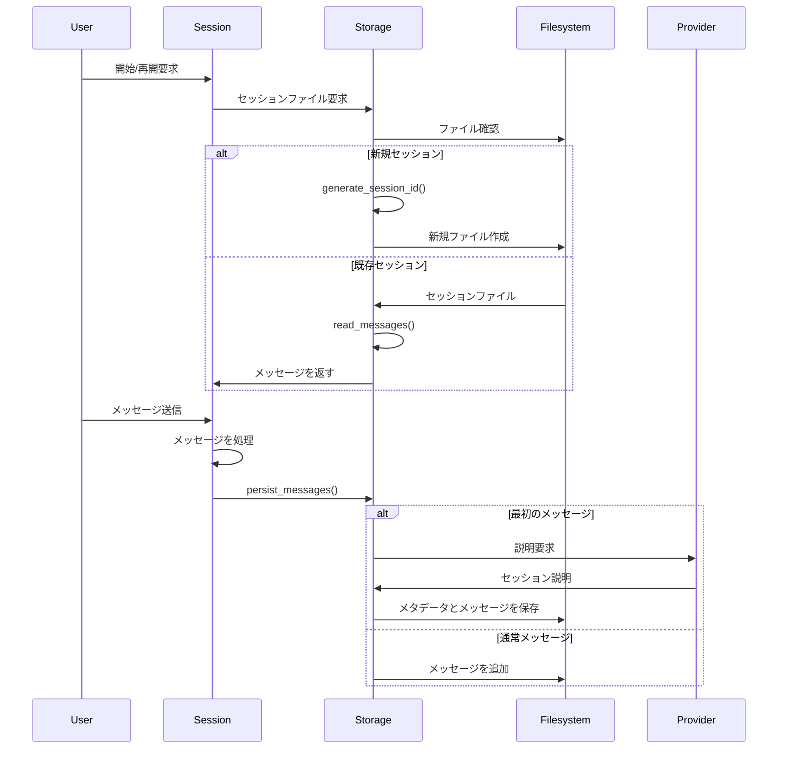

# Goose セッションストレージの実装

この文書では、Gooseのセッション情報の保存と管理を担当する `crates/goose/src/session/storage.rs` の機能と役割について説明します。

## 概要

`storage.rs` は、Gooseのセッション情報（会話履歴とメタデータ）をファイルシステムに永続化するための機能を提供します。主な役割は以下の通りです：

1. セッションの会話履歴（メッセージ）の読み書き
2. セッションのメタデータ（説明、作業ディレクトリなど）の管理
3. セッションファイルの命名と格納場所の管理
4. セッション一覧の取得とセッションIDの生成

## 主要コンポーネント

### SessionMetadata

セッションのメタデータを表す構造体で、セッションファイルの先頭行に保存されます。

```rust
pub struct SessionMetadata {
    /// 作業ディレクトリ
    pub working_dir: PathBuf,
    /// セッションの短い説明（通常3単語以下）
    pub description: String,
    /// メッセージ数
    pub message_count: usize,
    /// 使用された総トークン数
    pub total_tokens: Option<i32>,
}
```

このメタデータは、セッションの識別と管理に使用され、ユーザーインターフェイス上でセッションを表示する際にも利用されます。

### ファイル構造

セッションは JSONL 形式で保存されます：

1. 1行目：SessionMetadata（JSON形式）
2. 2行目以降：各メッセージ（各行がJSON形式のメッセージオブジェクト）

### 主要な関数

#### セッション管理

- `ensure_session_dir()` - セッションディレクトリが存在することを確認し、必要に応じて作成
- `get_most_recent_session()` - 最も最近変更されたセッションファイルのパスを取得
- `list_sessions()` - 利用可能なすべてのセッションファイルをリスト
- `generate_session_id()` - タイムスタンプ形式（yyyymmdd_hhmmss）のセッションIDを生成

#### データ読み書き

- `read_messages(session_file: &Path)` - セッションファイルからメッセージを読み込み
- `read_metadata(session_file: &Path)` - セッションファイルからメタデータのみを読み込み
- `persist_messages(session_file: &Path, messages: &[Message], provider: Option<Arc<Box<dyn Provider>>>)` - メッセージをセッションファイルに永続化
- `save_messages_with_metadata(session_file: &Path, metadata: &SessionMetadata, messages: &[Message])` - 指定されたメタデータとメッセージをセッションファイルに保存
- `update_metadata(session_file: &Path, metadata: &SessionMetadata)` - メタデータのみを更新（メッセージは変更せず）

#### セッション記述の自動生成

- `generate_description(session_file: &Path, messages: &[Message], provider: &dyn Provider)` - AIプロバイダーを使用してセッションの簡潔な説明を自動生成

## 保存場所

セッションファイルは、プラットフォーム固有のアプリケーションデータディレクトリに保存されます：

- macOS: `~/Library/Application Support/Block/goose/sessions/`
- Linux: `~/.local/share/Block/goose/sessions/`
- Windows: `%APPDATA%\Block\goose\sessions\`

## ファイル命名規則

セッションファイルは `.jsonl` 拡張子を持ち、通常はタイムスタンプベースのIDを使用して命名されます（例：`20250329_123456.jsonl`）。

## セッション説明の自動生成

セッションが最初に作成されたとき、または最初の数回のユーザーメッセージ後、システムはAIプロバイダーを使用して、そのセッションの簡潔な説明（4単語以下）を自動的に生成します。これにより、ユーザーは複数のセッションを容易に区別できるようになります。

## エラー処理

ファイルの読み書き操作は `anyhow::Result` を返し、エラーが発生した場合は適切に処理されます。これにより、ファイルシステムの問題によるアプリケーションのクラッシュを防ぎます。

## 後方互換性

古いバージョンのセッションファイル形式（メタデータに `working_dir` フィールドがないなど）をサポートするためのカスタムデシリアライザが実装されています。

## テスト

モジュールには、次のテストが含まれています：

- `test_read_write_messages` - メッセージの読み書きをテスト
- `test_empty_file` - 空のファイルを正しく処理できることをテスト
- `test_generate_session_id` - セッションID生成の形式をテスト

## セッションフロー図



## まとめ

`storage.rs` は、Gooseのセッション永続化の中核を担うコンポーネントです。これにより、ユーザーは複数のセッションを管理し、以前の会話を簡単に再開できます。メタデータの自動生成機能により、セッションの管理と識別が容易になり、ユーザーエクスペリエンスが向上します。