# Model Context Protocol (MCP) のルート機能

## rootsとは何か

rootsは、MCPにおいてサーバーが操作できる境界を定義する概念です。クライアントがサーバーに関連リソースとその場所を知らせる方法を提供します。

rootは、サーバーが焦点を当てるべきURIをクライアントが提案するものです。クライアントがサーバーに接続する際、サーバーが作業すべきrootsを宣言します。主にファイルシステムパスで使用されますが、rootsはHTTP URLsを含む任意の有効なURIにすることができます。

例えば、rootsは以下のようなものがあります:
- ファイルシステムパス: `/home/user/project`
- リポジトリURL: `https://github.com/username/repo`
- APIエンドポイント: `https://api.example.com/v1`

## rootsの主なメリット

1. **リソースの境界と焦点の明確化**: rootsはサーバーが操作できる境界を定義し、どのリソースが作業領域の一部であるかが明確になります。

2. **複数リソースの同時管理**: 複数のrootsを使用すると、異なるリソース（プロジェクトディレクトリ、リポジトリ、APIエンドポイントなど）を同時に扱うことができます。

3. **リソースの論理的分離**: 異なるリソース（例：ローカルリポジトリとAPIエンドポイント）を論理的に分離しながらも、サーバーが両方に焦点を当てることができます。

4. **リソース操作の優先順位付け**: サーバーはroot境界内の操作を優先することができ、関連性の高い情報に集中できます。

5. **柔軟なリソース指定**: rootsはファイルシステムパスだけでなく、HTTP URLsなど任意の有効なURIにすることができます。

```mermaid
%%{init: {
  'theme': 'dark',
  'themeCSS': '
    .nodeLabel { color: #FD971F !important; }
    .edgeLabel { color: #A6E22E !important; background-color: transparent !important; }
    .cluster rect { fill: #272822 !important; stroke: #F92672 !important; stroke-width: 2px !important; rx: 5px !important; ry: 5px !important; }
    .node rect, .node circle, .node ellipse, .node polygon, .node path { fill: #272822 !important; stroke: #A6E22E !important; stroke-width: 2px !important; }
    .flowchart-link { stroke: #66D9EF !important; stroke-width: 2px !important; }
  '
}}%%

graph TD
    subgraph \"MCP クライアント\"
        C[クライアント] --> |roots機能宣言| S[サーバー]
        C --> |rootsリスト提供| S
        C --> |roots変更通知| S
    end
    
    subgraph \"リソース境界\"
        S --> R1[Root 1: プロジェクトディレクトリ]
        S --> R2[Root 2: リポジトリ]
        S --> R3[Root 3: APIエンドポイント]
    end
    
    R1 --> F1[ファイル1]
    R1 --> F2[ファイル2]
    R2 --> C1[コード1]
    R2 --> C2[コード2]
    R3 --> A1[API 1]
    R3 --> A2[API 2]
    
    classDef type1 fill:#272822,stroke:#A6E22E,stroke-width:2px;
    classDef type2 fill:#272822,stroke:#66D9EF,stroke-width:2px;
    classDef type3 fill:#272822,stroke:#F92672,stroke-width:2px;
    classDef highlighted fill:#AE81FF,stroke:#66D9EF,stroke-width:3px,color:#FFF;
    
    class S highlighted;
    class R1,R2,R3 type1;
    class F1,F2,C1,C2,A1,A2 type2;
```

## rootsのユースケース

### 1. マルチプロジェクト開発環境

```mermaid
%%{init: {
  'theme': 'dark',
  'themeCSS': '
    .nodeLabel { color: #FD971F !important; }
    .edgeLabel { color: #A6E22E !important; background-color: transparent !important; }
    .cluster rect { fill: #272822 !important; stroke: #F92672 !important; stroke-width: 2px !important; rx: 5px !important; ry: 5px !important; }
    .node rect, .node circle, .node ellipse, .node polygon, .node path { fill: #272822 !important; stroke: #A6E22E !important; stroke-width: 2px !important; }
    .flowchart-link { stroke: #66D9EF !important; stroke-width: 2px !important; }
  '
}}%%

graph TD
    IDE[IDE/エディタ] --> |roots指定| Server[AIアシスタントサーバー]
    
    Server --> R1[Root 1: フロントエンドプロジェクト]
    Server --> R2[Root 2: バックエンドプロジェクト]
    Server --> R3[Root 3: 共通ライブラリ]
    
    R1 --> F1[React コンポーネント]
    R2 --> B1[API エンドポイント]
    R3 --> L1[ユーティリティ関数]
    
    classDef type1 fill:#272822,stroke:#A6E22E,stroke-width:2px;
    classDef type2 fill:#272822,stroke:#66D9EF,stroke-width:2px;
    classDef highlighted fill:#AE81FF,stroke:#66D9EF,stroke-width:3px,color:#FFF;
    
    class Server highlighted;
    class R1,R2,R3 type1;
    class F1,B1,L1 type2;
```

**メリット**:
- 複数の関連プロジェクトを同時に扱える
- AIアシスタントが全体のアーキテクチャを理解できる
- コード生成時に各プロジェクトの文脈を保持できる
- フロントエンドとバックエンドの整合性を維持しやすい

### 2. マイクロサービスアーキテクチャ

```mermaid
%%{init: {
  'theme': 'dark',
  'themeCSS': '
    .nodeLabel { color: #FD971F !important; }
    .edgeLabel { color: #A6E22E !important; background-color: transparent !important; }
    .cluster rect { fill: #272822 !important; stroke: #F92672 !important; stroke-width: 2px !important; rx: 5px !important; ry: 5px !important; }
    .node rect, .node circle, .node ellipse, .node polygon, .node path { fill: #272822 !important; stroke: #A6E22E !important; stroke-width: 2px !important; }
    .flowchart-link { stroke: #66D9EF !important; stroke-width: 2px !important; }
  '
}}%%

graph TD
    subgraph \"マイクロサービスアーキテクチャ\"
        AI[AI開発環境] --> |roots設定| S[サーバー]
        
        S --> MS1[Root 1: 認証サービス]
        S --> MS2[Root 2: 商品サービス]
        S --> MS3[Root 3: 注文サービス]
        S --> MS4[Root 4: APIゲートウェイ]
    end
    
    MS1 --> |参照| MS4
    MS2 --> |参照| MS4
    MS3 --> |参照| MS4
    
    classDef type1 fill:#272822,stroke:#A6E22E,stroke-width:2px;
    classDef highlighted fill:#AE81FF,stroke:#66D9EF,stroke-width:3px,color:#FFF;
    
    class S highlighted;
    class MS1,MS2,MS3,MS4 type1;
```

**メリット**:
- 複数のマイクロサービスの相互関係を理解できる
- サービス間の整合性を確保できる
- APIの変更が他サービスに与える影響を把握できる
- グローバルな変更を適切に適用できる

### 3. ドキュメント生成と保守

```mermaid
%%{init: {
  'theme': 'dark',
  'themeCSS': '
    .nodeLabel { color: #FD971F !important; }
    .edgeLabel { color: #A6E22E !important; background-color: transparent !important; }
    .cluster rect { fill: #272822 !important; stroke: #F92672 !important; stroke-width: 2px !important; rx: 5px !important; ry: 5px !important; }
    .node rect, .node circle, .node ellipse, .node polygon, .node path { fill: #272822 !important; stroke: #A6E22E !important; stroke-width: 2px !important; }
    .flowchart-link { stroke: #66D9EF !important; stroke-width: 2px !important; }
  '
}}%%

graph TD
    Tool[ドキュメントツール] --> |roots定義| Server[AIサーバー]
    
    Server --> R1[Root 1: ソースコード]
    Server --> R2[Root 2: 既存ドキュメント]
    Server --> R3[Root 3: APIスペック]
    Server --> R4[Root 4: 出力ディレクトリ]
    
    R1 --> SC[実装コード]
    R2 --> ED[既存マニュアル]
    R3 --> API[OpenAPI定義]
    R4 --> OD[生成ドキュメント]
    
    classDef type1 fill:#272822,stroke:#A6E22E,stroke-width:2px;
    classDef type2 fill:#272822,stroke:#66D9EF,stroke-width:2px;
    classDef highlighted fill:#AE81FF,stroke:#66D9EF,stroke-width:3px,color:#FFF;
    
    class Server highlighted;
    class R1,R2,R3,R4 type1;
    class SC,ED,API,OD type2;
```

**メリット**:
- コードと既存ドキュメントの整合性を確保
- 異なる情報源（コード、API仕様、マニュアル）を統合
- ドキュメントの自動生成と更新が容易
- ソースと出力の明確な分離

### 4. モノレポ管理

```mermaid
%%{init: {
  'theme': 'dark',
  'themeCSS': '
    .nodeLabel { color: #FD971F !important; }
    .edgeLabel { color: #A6E22E !important; background-color: transparent !important; }
    .cluster rect { fill: #272822 !important; stroke: #F92672 !important; stroke-width: 2px !important; rx: 5px !important; ry: 5px !important; }
    .node rect, .node circle, .node ellipse, .node polygon, .node path { fill: #272822 !important; stroke: #A6E22E !important; stroke-width: 2px !important; }
    .flowchart-link { stroke: #66D9EF !important; stroke-width: 2px !important; }
  '
}}%%

graph TD
    Client[開発環境] --> |roots設定| S[AIサービス]
    
    S --> R1[Root: モノレポルート]
    
    R1 --> P1[パッケージ1: UI]
    R1 --> P2[パッケージ2: データ]
    R1 --> P3[パッケージ3: 設定]
    R1 --> P4[パッケージ4: テスト]
    
    P1 --> C1[コンポーネントライブラリ]
    P2 --> D1[データモデル]
    P3 --> CF1[設定ファイル]
    P4 --> T1[テストユーティリティ]
    
    classDef type1 fill:#272822,stroke:#A6E22E,stroke-width:2px;
    classDef type2 fill:#272822,stroke:#66D9EF,stroke-width:2px;
    classDef type3 fill:#272822,stroke:#F92672,stroke-width:2px;
    classDef highlighted fill:#AE81FF,stroke:#66D9EF,stroke-width:3px,color:#FFF;
    
    class S highlighted;
    class R1 type1;
    class P1,P2,P3,P4 type2;
    class C1,D1,CF1,T1 type3;
```

**メリット**:
- 大規模なモノレポ内の関連パッケージを同時に扱える
- パッケージ間の依存関係を理解できる
- 変更の影響範囲を把握しやすい
- 全体のアーキテクチャを考慮した開発が可能

### 5. マルチソース情報統合

```mermaid
%%{init: {
  'theme': 'dark',
  'themeCSS': '
    .nodeLabel { color: #FD971F !important; }
    .edgeLabel { color: #A6E22E !important; background-color: transparent !important; }
    .cluster rect { fill: #272822 !important; stroke: #F92672 !important; stroke-width: 2px !important; rx: 5px !important; ry: 5px !important; }
    .node rect, .node circle, .node ellipse, .node polygon, .node path { fill: #272822 !important; stroke: #A6E22E !important; stroke-width: 2px !important; }
    .flowchart-link { stroke: #66D9EF !important; stroke-width: 2px !important; }
  '
}}%%

graph TD
    App[アプリケーション] --> |roots定義| Server[AIサーバー]
    
    Server --> R1[Root 1: ローカルリポジトリ]
    Server --> R2[Root 2: リモートAPI]
    Server --> R3[Root 3: データベースアクセス]
    Server --> R4[Root 4: 設定ファイル]
    
    R1 --> LC[ローカルコード]
    R2 --> |https://| RA[リモートAPIエンドポイント]
    R3 --> |db://| DB[データベース]
    R4 --> CF[設定ファイル]
    
    classDef type1 fill:#272822,stroke:#A6E22E,stroke-width:2px;
    classDef type2 fill:#272822,stroke:#66D9EF,stroke-width:2px;
    classDef highlighted fill:#AE81FF,stroke:#66D9EF,stroke-width:3px,color:#FFF;
    classDef dashed fill:#272822,stroke:#FD971F,stroke-width:2px,stroke-dasharray: 5 5;
    
    class Server highlighted;
    class R1,R4 type1;
    class R2,R3 dashed;
    class LC,RA,DB,CF type2;
```

**メリット**:
- ローカルコードとリモートリソースの統合
- 複数のデータソース（ファイル、API、DB）を一元管理
- 異なるプロトコル（file://、https://、db://など）を扱える
- 設定と実装の分離が明確

## 実際の応用例

### 1. VS CodeでのAI支援開発

VS CodeのAI拡張機能は、複数のワークスペースフォルダをrootsとして扱い、AI（例：GitHub Copilot）が関連するコードベース全体を理解できるようにします。これにより：

- フロントエンド・バックエンド間の一貫性のあるコード提案
- プロジェクトのコーディング規約に沿った提案
- 既存コードパターンを学習した適切な補完

### 2. CI/CDパイプラインでのドキュメント自動更新

CI/CDパイプラインでは、rootsを使用して：

- コードベース（ソースroot）
- OpenAPI仕様（APIリファレンスroot）
- ドキュメントサイト（出力root）

を指定し、コード変更時に自動的にドキュメントを更新します。

### 3. マイクロサービスモニタリング

モニタリングツールは、異なるマイクロサービスをrootsとして定義し、サービス間のトラフィックや依存関係を可視化します。これにより：

- サービス間の関係性の把握
- 問題の根本原因の特定が容易
- サービス変更の影響範囲の予測

## rootsの動作方法

rootsをサポートするクライアントは：

1. 接続中に `roots` 機能を宣言します
2. サーバーに推奨rootsのリストを提供します
3. サポートされている場合、rootsが変更されるとサーバーに通知します

rootsは情報提供的なものであり、厳密に強制するものではありませんが、サーバーは：

1. 提供されたrootsを尊重すべきです
2. rootのURIを使用してリソースを探し、アクセスすべきです
3. root境界内の操作を優先すべきです

## ベストプラクティス

rootsを使用する際の推奨事項：

1. 必要なリソースのみを提案する
2. rootsには明確で説明的な名前を使用する
3. rootのアクセス可能性を監視する
4. root変更を適切に処理する