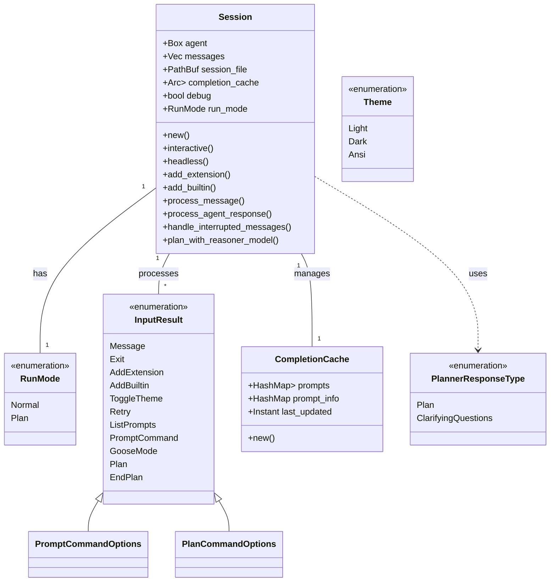
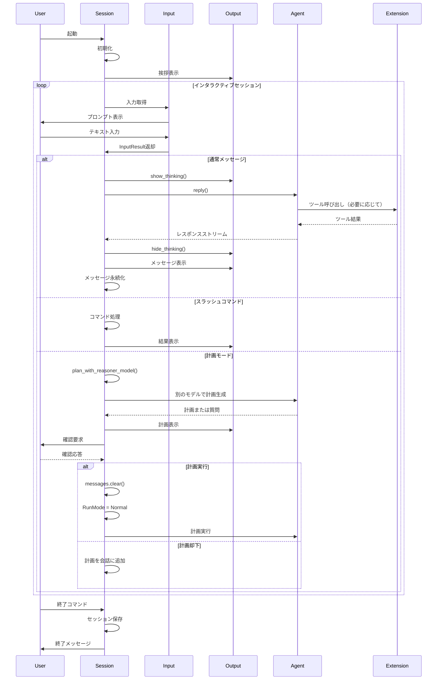

<!-- TOC -->
* [Gooseのセッションモジュール詳細解析](#gooseのセッションモジュール詳細解析)
  * [入力処理システム（input.rs）](#入力処理システムinputrs)
    * [InputResult 列挙型](#inputresult-列挙型)
    * [入力解析フロー](#入力解析フロー)
    * [スラッシュコマンドの種類](#スラッシュコマンドの種類)
    * [入力パラメータ処理](#入力パラメータ処理)
  * [出力表示システム（output.rs）](#出力表示システムoutputrs)
    * [テーマ管理](#テーマ管理)
    * [表示コンポーネント](#表示コンポーネント)
    * [メッセージ表示](#メッセージ表示)
    * [モード表示](#モード表示)
    * [ツール表示](#ツール表示)
    * [ユーティリティ表示](#ユーティリティ表示)
    * [フォーマット補助関数](#フォーマット補助関数)
  * [セッションフローの詳細](#セッションフローの詳細)
  * [主要な実装パターン](#主要な実装パターン)
* [Gooseセッションモジュールのアーキテクチャ図](#gooseセッションモジュールのアーキテクチャ図)
  * [コンポーネント構造図](#コンポーネント構造図)
  * [セッションフロー図](#セッションフロー図)
  * [データフロー図](#データフロー図)
<!-- TOC -->

# Gooseのセッションモジュール詳細解析

## 入力処理システム（input.rs）

`input.rs`ファイルは、Gooseのユーザー入力処理を担当しています。主に以下の機能を提供します：

### InputResult 列挙型

```rust
pub enum InputResult {
    Message(String),            // 通常のテキストメッセージ
    Exit,                       // 終了コマンド
    AddExtension(String),       // 拡張機能追加
    AddBuiltin(String),         // 組み込み拡張機能追加
    ToggleTheme,                // テーマ切り替え
    Retry,                      // 再試行（空入力時）
    ListPrompts(Option<String>), // プロンプト一覧表示
    PromptCommand(PromptCommandOptions), // プロンプトコマンド
    GooseMode(String),          // Gooseモード設定
    Plan(PlanCommandOptions),   // 計画モード
    EndPlan,                    // 計画モード終了
}
```

### 入力解析フロー

1. `get_input` 関数
- rustylineライブラリを使用したインタラクティブな入力取得
- Ctrl+Jをニューライン入力として設定
- 入力履歴の管理

2. `handle_slash_command` 関数
- スラッシュで始まるコマンドの解析
- 様々なコマンドタイプへの分岐処理

3. 特殊コマンド処理関数
- `parse_prompts_command`: `/prompts`コマンドの解析
- `parse_prompt_command`: `/prompt`コマンドの解析
- `parse_plan_command`: `/plan`コマンドの解析

### スラッシュコマンドの種類

- `/exit`, `/quit`: セッション終了
- `/help`, `/?`: ヘルプメッセージ表示
- `/t`: テーマ切り替え
- `/prompts`: 利用可能なプロンプト一覧表示
- `/prompt`: プロンプト実行または情報表示
- `/extension`: 外部拡張機能の追加
- `/builtin`: 組み込み拡張機能の追加
- `/mode`: Gooseモードの設定（auto, approve, chat）
- `/plan`: 計画モードの開始
- `/endplan`: 計画モードの終了

### 入力パラメータ処理

- `PromptCommandOptions`構造体: プロンプト実行のオプション管理
- `PlanCommandOptions`構造体: 計画モードのオプション管理
- shellexライブラリを使用した引数解析（クォート対応）

## 出力表示システム（output.rs）

`output.rs`ファイルは、Gooseの出力表示を担当しています。主に以下の機能を提供します：

### テーマ管理

```rust
pub enum Theme {
    Light,  // 明るいテーマ
    Dark,   // 暗いテーマ
    Ansi,   // ANSIカラーテーマ
}
```

- `set_theme`: テーマの設定
- `get_theme`: 現在のテーマ取得
- スレッドローカル変数による状態管理

### 表示コンポーネント

1. `ThinkingIndicator`: AIが考えている間のスピナー表示
- `show_thinking`: スピナー表示開始
- `hide_thinking`: スピナー表示終了

2. `PromptInfo`: プロンプト情報の構造体
- 名前、説明、引数、拡張機能名を保持

### メッセージ表示

- `render_message`: メッセージの種類に応じた表示
  - テキスト表示
  - ツールリクエスト表示
  - ツールレスポンス表示
  - 画像表示
  - 思考プロセス表示

### モード表示

- `render_enter_plan_mode`: 計画モード開始表示
- `render_act_on_plan`: 計画実行表示
- `render_exit_plan_mode`: 計画モード終了表示
- `goose_mode_message`: モード変更メッセージ

### ツール表示

- `render_tool_request`: ツールリクエストの表示
  - テキストエディタ、シェル、その他のツールで表示を変更
- `render_tool_response`: ツールレスポンスの表示
  - 優先度に基づくフィルタリング

### ユーティリティ表示

- `render_error`: エラーメッセージ表示
- `render_prompts`: プロンプト一覧表示
- `render_prompt_info`: プロンプト詳細表示
- `render_extension_success`: 拡張機能追加成功表示
- `render_extension_error`: 拡張機能追加失敗表示
- `render_builtin_success`: 組み込み拡張機能追加成功表示
- `render_builtin_error`: 組み込み拡張機能追加失敗表示

### フォーマット補助関数

- `print_tool_header`: ツールヘッダー表示
- `print_markdown`: マークダウンテキスト表示（batライブラリ使用）
- `print_params`: パラメータ階層表示
- `shorten_path`: 長いパスの短縮表示
- `display_session_info`: セッション情報表示
- `display_greeting`: 起動時の挨拶表示

## セッションフローの詳細

以下は、`session/mod.rs`を中心としたGooseのセッションフローの詳細です:

1. **セッション初期化**
- `build_session`関数（builder.rs）でセッションを構築
- 既存のセッションファイル（.goose/session.json）からメッセージを読み込み
- セッション情報（プロバイダー、モデル、ファイルパス）を表示

2. **拡張機能の初期化**
- デフォルトの拡張機能のロード
- 設定ファイルに基づく追加拡張機能のロード

3. **ユーザー入力ループ**
- `interactive`メソッドでメインループを開始
- コマンド履歴の管理（~/.config/goose/history.txt）
- 起動時の挨拶メッセージ表示

4. **入力解析と処理**
- `input::get_input`でユーザー入力を取得
- 入力タイプ（通常メッセージ、コマンド）に応じて分岐
- `InputResult`に基づく適切な処理の実行

5. **AIエージェント通信**
- `process_agent_response`メソッドでエージェントとの通信
- ストリーミングレスポンスの処理
- 思考表示のオン/オフ切り替え

6. **メッセージ表示**
- `output::render_message`でメッセージを表示
- メッセージタイプに応じた適切なレンダリング
- テーマに基づく表示スタイルの適用

7. **ツール実行管理**
- ツールリクエストと確認プロンプトの表示
- ツール結果の処理と表示
- 割り込み（Ctrl+C）時の適切な処理

8. **セッション状態管理**
- メッセージの永続化（session::persist_messages）
- 割り込み処理とリカバリ（handle_interrupted_messages）
- 終了時のセッション情報保存

9. **計画モード処理**
- `plan_with_reasoner_model`による計画生成
- 別のAIモデル（リーズナー）の使用
- 計画または追加質問の判別と処理

10. **補完機能**
- `update_completion_cache`による補完データの更新
- rustylineとカスタム補完ヘルパーを使用
- 拡張機能追加時のキャッシュ無効化

## 主要な実装パターン

1. **非同期プログラミング**
- tokioを使用した非同期ランタイム
- asyncメソッドと.awaを活用した非ブロッキング処理
- tokio::selectによる並行タスク管理

2. **エラー処理**
- anyhowによる統一的なエラーハンドリング
- Result型を使用した一貫したエラー伝播
- フォールバックメカニズム（例：メッセージ読み込み失敗時）

3. **状態管理**
- スレッドローカル変数（thread_local!）を使用した状態管理
- RefCellによる内部可変性の提供
- セッション状態の永続化と復元

4. **トレイト実装と多態性**
- Box<dyn Agent>を使用したエージェント抽象化
- 異なるプロバイダー実装のサポート
- 拡張機能の動的な追加と管理

5. **ユーザーインターフェース設計**
- コマンドライン引数と対話式インターフェース
- カラー表示とスタイリング（consoleライブラリ）
- マークダウンレンダリング（batライブラリ）

6. **構成と設定**
- 環境変数とコンフィグファイルの使用
- デフォルト値と優先順位のある設定
- グローバル/ローカル設定の区別

7. **モジュール設計**
- 関心の分離（入力処理、出力表示、セッション管理）
- 明確なインターフェースとカプセル化
- 再利用可能なコンポーネント

これらの実装を通じて、Gooseはユーザー入力から始まり、AIエージェントとの通信、ツール実行、そして結果表示までの一連のフローを効率的に管理し、豊かな対話体験を提供しています。

# Gooseセッションモジュールのアーキテクチャ図

Gooseのセッションモジュールの構造と動作フローを視覚的に表現するための図です。

## コンポーネント構造図



## セッションフロー図



## データフロー図

```mermaid
%%{init: { 'theme': 'monokai' } }%%
flowchart TB
    subgraph Input
        UserInput[ユーザー入力] --> InputParser[入力パーサー]
        InputParser --> InputResult[InputResult列挙型]
    end
    
    subgraph Session
        SessionInit[セッション初期化] --> SessionLoop[セッションループ]
        SessionLoop --> ProcessMessage[メッセージ処理]
        SessionLoop --> ProcessCommand[コマンド処理]
        SessionLoop --> PlanMode[計画モード]
        
        ProcessMessage --> AgentCommunication[エージェント通信]
        PlanMode --> ReasonerModel[リーズナーモデル]
        
        AgentCommunication --> ToolExecution[ツール実行]
        AgentCommunication --> MessageProcessing[メッセージ処理]
        
        MessageProcessing --> MessagePersistence[メッセージ永続化]
    end
    
    subgraph Output
        RenderMessage[メッセージ表示] --> ThemeManager[テーマ管理]
        RenderMessage --> ToolRenderer[ツール表示]
        RenderMessage --> MessageRenderer[テキスト表示]
        
        ThinkingIndicator[考え中表示] --> SpinnerDisplay[スピナー表示]
    end
    
    InputResult --> SessionLoop
    ProcessMessage --> RenderMessage
    MessageProcessing --> RenderMessage
    SessionLoop --> ThinkingIndicator