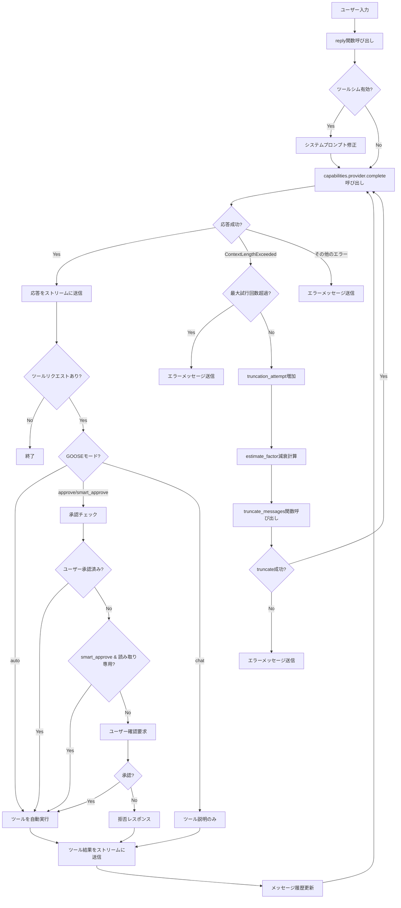
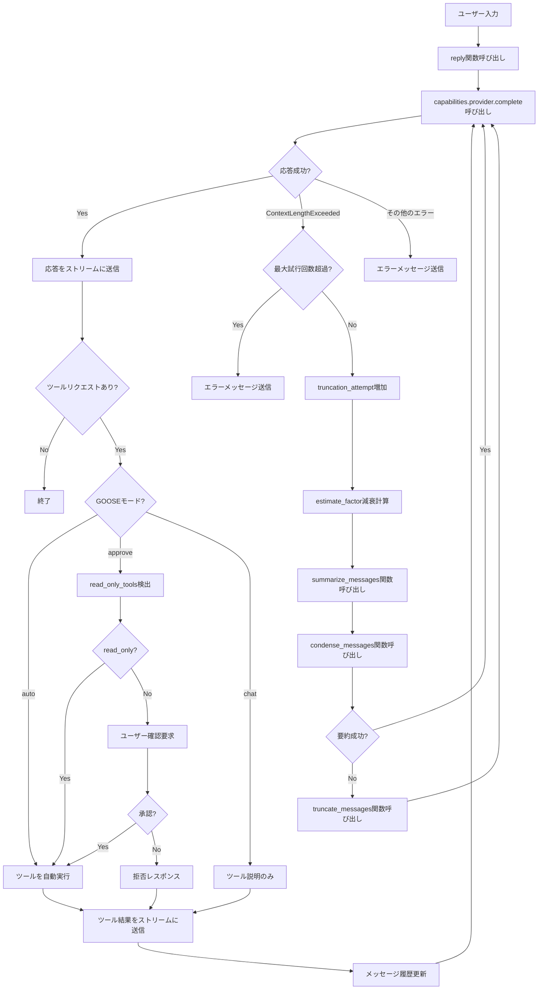
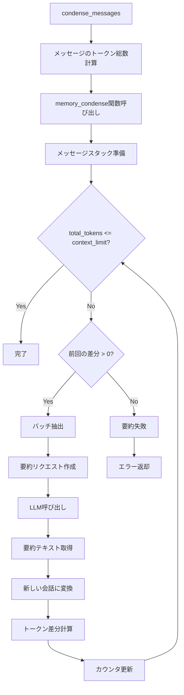
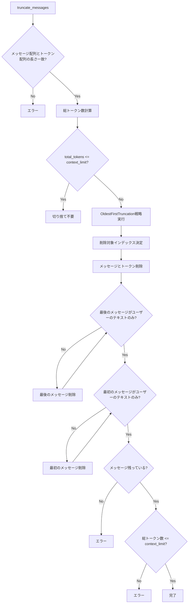
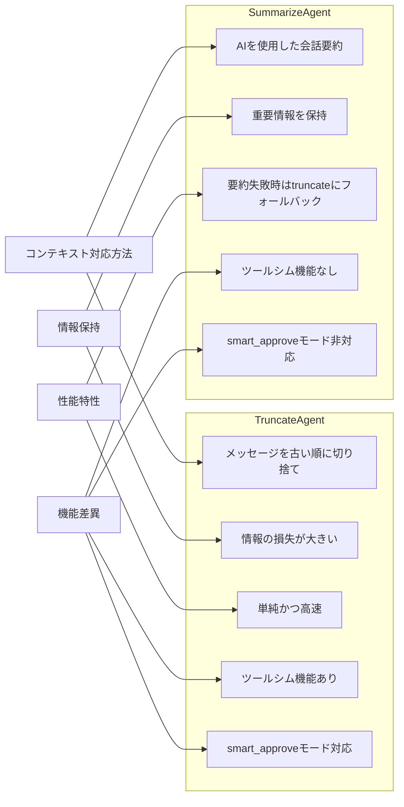

# Gooseのエージェント実装解析：TruncateAgentとSummarizeAgent

このドキュメントでは、Gooseフレームワークの中核となる2つのエージェント実装、`TruncateAgent`と`SummarizeAgent`の役割と機能について詳細に解説します。これらのエージェントはユーザーとAIモデル間の対話を管理し、コンテキスト制限の処理方法が異なります。

## 1. 共通の基盤

両エージェントは`Agent`トレイトを実装しており、以下の共通機能を持っています：

- 拡張機能の管理（追加、削除、一覧表示）
- システムプロンプトの操作（拡張、上書き）
- プロンプト管理（一覧表示、取得）
- ツール承認処理
- レスポンスストリーミング

基本構造：

```rust
pub struct TruncateAgent/SummarizeAgent {
    capabilities: Mutex<Capabilities>,       // 機能・ツール管理
    token_counter: TokenCounter,             // トークン数計算
    confirmation_tx: mpsc::Sender<(String, bool)>,  // 確認チャネル送信
    confirmation_rx: Mutex<mpsc::Receiver<(String, bool)>>, // 確認チャネル受信
}
```

## 2. TruncateAgent（切り捨てエージェント）

### 2.1 役割と特徴

`TruncateAgent`は、会話履歴がモデルのコンテキスト制限を超えた場合に、古いメッセージを切り捨てることで対応します。主な特徴：

- 単純な切り捨て戦略を使用（古いメッセージから順に削除）
- リソース読み取り機能はない（コメントに明記）
- 最大3回の切り捨て試行を行う

### 2.2 truncate_messagesメソッド

```rust
async fn truncate_messages(
    &self,
    messages: &mut Vec<Message>,
    estimate_factor: f32,
    system_prompt: &str,
    tools: &mut Vec<Tool>,
) -> anyhow::Result<()>
```

このメソッドは以下のステップで会話履歴を切り捨てます：

1. モデルの実際のコンテキスト制限を取得
2. 安全マージンを適用（estimate_factor）
3. システムプロンプトとツールのトークン数を差し引く
4. 各メッセージのトークン数を計算
5. `truncate_messages`関数を呼び出して古いメッセージから削除

### 2.3 replyメソッドの実装

`reply`メソッドは非同期ストリームを返し、以下の処理を行います：

1. **初期設定**：
   - メッセージ履歴のコピー作成
   - Capabilitiesロックの取得
   - ツールリストの取得
   - GOOSEモードの設定読み込み

2. **リソースツールの追加**：
   - 拡張機能がリソースをサポートする場合、リソース操作ツールを追加

3. **ツールシム処理**（ollama対応）：
   - ツールシムが有効な場合、システムプロンプトを修正
   - JSON形式のツールレスポンス対応

4. **メインループ**：
   - モデルへの送信と応答処理
   - ツールリクエストの検出と処理
   - 例外処理

5. **コンテキスト制限超過処理**：
   - 最大試行回数のチェック
   - 推定係数の減衰適用
   - メッセージの切り捨て
   - 再試行

6. **モード別ツール処理**：
   - `auto`モード：自動的にすべてのツールを実行
   - `approve`モード：ユーザー承認に基づいてツールを実行
   - `smart_approve`モード：読み取り専用ツールは自動実行
   - `chat`モード：ツール実行をスキップし説明を提供

7. **並列ツール実行**：
   - 複数のツールリクエストを並列処理
   - `futures::future::join_all`による待機

## 3. SummarizeAgent（要約エージェント）

### 3.1 役割と特徴

`SummarizeAgent`は、会話履歴がモデルのコンテキスト制限を超えた場合に、古いメッセージを要約することで対応します。主な特徴：

- AIモデルを使用して会話を要約
- 要約に失敗した場合は切り捨て処理にフォールバック
- よりコンテキストを保持した対話が可能

### 3.2 summarize_messagesメソッド

```rust
async fn summarize_messages(
    &self,
    messages: &mut Vec<Message>,
    estimate_factor: f32,
    system_prompt: &str,
    tools: &mut Vec<Tool>,
) -> anyhow::Result<()>
```

このメソッドは以下のステップで会話履歴を要約します：

1. モデルの実際のコンテキスト制限を取得
2. 安全マージンを適用（estimate_factor）
3. システムプロンプトとツールのトークン数を差し引く
4. 各メッセージのトークン数を計算
5. `condense_messages`関数を呼び出してメッセージを要約
6. 要約に失敗した場合は`truncate_messages`にフォールバック

### 3.3 replyメソッドの実装

`reply`メソッドは`TruncateAgent`と多くの部分が共通していますが、以下の違いがあります：

1. **ツールシム非対応**：
   - ollamaに対するツールシム機能は実装されていない

2. **コンテキスト制限超過処理**：
   - `summarize_messages`メソッドを使用
   - 会話履歴の要約を試みる

3. **`smart_approve`非対応**：
   - `approve`モードは実装されているが、`smart_approve`は実装されていない

## 4. 重要な実装の詳細比較

### 4.1 コンテキスト管理の違い

| TruncateAgent | SummarizeAgent |
|---------------|----------------|
| 古いメッセージを単純に削除 | AIモデルを使って会話を要約 |
| 情報の損失が大きい | 重要な情報を保持しようとする |
| 実装がシンプル | 要約失敗時にフォールバック機構あり |
| `truncate_messages`関数を直接使用 | `condense_messages`を試し、失敗時に`truncate_messages`使用 |

### 4.2 replyメソッドの実装

両エージェントの`reply`メソッドの核となる部分（ループ内）を簡略化すると：

```rust
loop {
    match capabilities.provider().complete(&system_prompt, &messages, &tools).await {
        Ok((response, usage)) => {
            // セッション情報更新
            // 応答をストリームに送信
            // ツールリクエスト処理
        },
        Err(ProviderError::ContextLengthExceeded(_)) => {
            if truncation_attempt >= MAX_TRUNCATION_ATTEMPTS {
                // エラーメッセージ
                break;
            }
            
            truncation_attempt += 1;
            let estimate_factor = ESTIMATE_FACTOR_DECAY.powi(truncation_attempt as i32);
            
            // TruncateAgentの場合
            self.truncate_messages(&mut messages, estimate_factor, &system_prompt, &mut tools).await?;
            
            // SummarizeAgentの場合
            self.summarize_messages(&mut messages, estimate_factor, &system_prompt, &mut tools).await?;
            
            continue;
        },
        Err(e) => {
            // エラーメッセージ
            break;
        }
    }
}
```

### 4.3 ツールリクエスト処理

ツールリクエスト処理の流れ：

1. 応答からツールリクエストを抽出
2. GOOSEモードに基づいて処理方法を決定
3. 必要に応じてユーザー確認を取得
4. ツールを実行して結果を取得
5. 結果メッセージを構築してストリームに送信
6. メッセージ履歴を更新

特に注目すべき点として、TruncateAgentでは`smart_approve`モードが実装されており、`detect_read_only_tools`関数を使用して読み取り専用ツールを自動的に承認します。

### 4.4 共通の機能

両エージェントは以下の重要な共通機能を持っています：

- **非同期ストリーミング**：
  - `async_stream::try_stream!`マクロを使用した非同期ストリーム生成
  - チャンク単位での応答送信

- **並列ツール実行**：
  - `futures::future::join_all`を使用した並列実行
  - 全ツールの完了を効率的に待機

- **割り込み対応**：
  - `tokio::task::yield_now()`による協調的なスケジューリング
  - 長時間実行の防止

- **セッション状態管理**：
  - セッションメタデータの更新
  - トークン使用量の追跡

- **エラー処理**：
  - コンテキスト長超過の特別処理
  - 一般的なエラーメッセージ生成

## 5. Capabilities::get_prefixed_toolsメソッドの詳細解析

`capabilities.rs`の`get_prefixed_tools`メソッドは、GooseエージェントがLLMに提供するツール一覧を構築する重要な役割を担っています。このメソッドはエージェントの`reply`メソッド内で呼び出され、利用可能なすべてのツールを収集してプレフィックスを付与します。

### 5.1 メソッドの実装

```rust
/// Get all tools from all clients with proper prefixing
pub async fn get_prefixed_tools(&mut self) -> ExtensionResult<Vec<Tool>> {
    let mut tools = Vec::new();
    for (name, client) in &self.clients {
        let client_guard = client.lock().await;
        let mut client_tools = client_guard.list_tools(None).await?;

        loop {
            for tool in client_tools.tools {
                tools.push(Tool::new(
                    format!("{}__{}", name, tool.name),
                    &tool.description,
                    tool.input_schema,
                ));
            }

            // exit loop when there are no more pages
            if client_tools.next_cursor.is_none() {
                break;
            }

            client_tools = client_guard.list_tools(client_tools.next_cursor).await?;
        }
    }
    Ok(tools)
}
```

### 5.2 処理フロー

このメソッドは以下のステップでツールを収集します：

1. **ツールリストの初期化**: 空のベクターを作成
2. **クライアントループ**: 登録されている各クライアント（拡張機能）に対して処理
3. **クライアントロック取得**: 各クライアントに排他的にアクセス
4. **初期ツール一覧取得**: `list_tools(None)`で最初のページのツールを取得
5. **ページング処理**: 複数ページにわたるツールリストを処理するためのループ
   - 各ツールにプレフィックスを付与して新しいツールとして追加
   - 次のページがあれば取得を継続、なければループ終了
6. **結果返却**: プレフィックス付きツールリストを返却

### 5.3 プレフィックス付与の重要性

`format!("{}__{}", name, tool.name)`によって、各ツール名の前に拡張機能名（クライアント名）とダブルアンダースコア（`__`）が付与されます。これには以下の重要な理由があります：

1. **名前空間分離**: 異なる拡張機能が同じ名前のツールを提供しても競合しない
2. **ルーティング目的**: ツール呼び出し時に、どの拡張機能に送信すべきかを特定できる
3. **ユーザー識別性**: ユーザーやLLMがツールの提供元を明確に把握できる

### 5.4 ページング対応

このメソッドは、大量のツールを持つ拡張機能に対応するため、カーソルベースのページングをサポートしています：

```rust
// exit loop when there are no more pages
if client_tools.next_cursor.is_none() {
    break;
}

client_tools = client_guard.list_tools(client_tools.next_cursor).await?;
```

このロジックにより、クライアントが多数のツールを持っている場合でも、すべてのツールを確実に収集できます。

### 5.5 `Tool`オブジェクトの構築

各ツールは以下の3つの要素を持つ`Tool`オブジェクトとして構築されます：

1. **name**: プレフィックス付きのツール名（`extension_name__tool_name`形式）
2. **description**: ツールの説明文（そのまま使用）
3. **input_schema**: ツールの入力パラメータスキーマ（そのまま使用）

### 5.6 エラー処理

このメソッドは`ExtensionResult<Vec<Tool>>`を返し、いずれかのクライアントからのツール取得に失敗した場合はエラーを伝播します。これにより、ツール収集中の問題を上位コンポーネントが適切に処理できます。

### 5.7 replyメソッドとの連携

`reply`メソッド内では以下のようにこのメソッドが使用されます：

```rust
let mut capabilities = self.capabilities.lock().await;
let mut tools = capabilities.get_prefixed_tools().await?;
```

この呼び出しにより、AIモデルに渡されるツールリストが構築され、モデルはこれらのツールを参照して適切なツール呼び出しを生成できるようになります。

### 5.8 dispatch_tool_callメソッドとの連携

`get_prefixed_tools`で構築されたプレフィックス付きツール名は、後に`dispatch_tool_call`メソッドでツール呼び出しをルーティングする際に利用されます：

```rust
fn get_client_for_tool(&self, prefixed_name: &str) -> Option<(&str, McpClientBox)> {
    self.clients
        .iter()
        .find(|(key, _)| prefixed_name.starts_with(*key))
        .map(|(name, client)| (name.as_str(), Arc::clone(client)))
}
```

この仕組みにより、LLMが生成したツール呼び出しを適切な拡張機能にルーティングできます。

### 5.9 normalize関数との関係

`get_prefixed_tools`で使用される拡張機能名は、事前に`normalize`関数によって正規化されています：

```rust
fn normalize(input: String) -> String {
    let mut result = String::with_capacity(input.len());
    for c in input.chars() {
        result.push(match c {
            c if c.is_ascii_alphanumeric() || c == '_' || c == '-' => c,
            c if c.is_whitespace() => continue, // effectively "strip" whitespace
            _ => '_',                           // Replace any other non-ASCII character with '_'
        });
    }
    result.to_lowercase()
}
```

この正規化により、拡張機能名に含まれる特殊文字や空白を処理し、一貫した命名規則が維持されます。

## 6. エージェント選択の影響

適切なエージェントの選択は、特に長い会話で重要な影響を与えます：

### TruncateAgentを選択する場合

- **メリット**：
  - シンプルで予測可能な動作
  - メモリ使用量が低い
  - 処理が高速

- **デメリット**：
  - 古い会話の文脈が完全に失われる
  - ユーザーが以前の会話を参照すると混乱する可能性

### SummarizeAgentを選択する場合

- **メリット**：
  - 長い会話でもコンテキストの連続性を維持
  - 以前の会話への参照が機能する可能性が高い
  - より自然な対話体験

- **デメリット**：
  - 追加のモデル呼び出しが必要（要約生成）
  - 処理に時間がかかる
  - 要約の質がモデルに依存

## 7. 実装詳細のハイライト

### 7.1 トークン計算と制限管理

両エージェントともに、以下の手順でトークン計算と制限管理を行います：

1. モデルの公称コンテキスト制限を取得
2. 安全マージン（estimate_factor）を適用
3. システムプロンプトとツールのトークンを差し引く
4. 残りのトークン数をメッセージに割り当て

安全マージンは切り捨て試行ごとに減少し、最初は90%、次は81%、その次は72.9%となります。

### 7.2 リソースツールの追加

リソースをサポートする拡張機能がある場合、両エージェントは以下の2つのツールを追加します：

1. `platform__read_resource`：特定のリソースを読み取る
2. `platform__list_resources`：利用可能なリソースを一覧表示

これにより、拡張機能が提供するコンテキストデータへのアクセスが可能になります。

### 7.3 GOOSEモード処理

GOOSEモードは、ツールリクエストの処理方法を制御します：

- **auto**：ユーザー確認なしで自動的にツールを実行
- **approve**：すべてのツールにユーザー確認を要求（読み取り専用ツールを除く）
- **smart_approve**（TruncateAgentのみ）：読み取り専用ツールは自動実行、それ以外は確認を要求
- **chat**：ツール実行を行わず、実行計画のみを提示

## 8. 結論

`TruncateAgent`と`SummarizeAgent`は、Gooseフレームワークにおける2つの重要なエージェント実装です。どちらも`Agent`トレイトを実装し、同様のインターフェースを提供しますが、コンテキスト制限を超えた場合の対処法が大きく異なります。

`TruncateAgent`は単純な切り捨て戦略を採用し、古いメッセージを削除することでコンテキスト制限に対応します。一方、`SummarizeAgent`はAIモデルを活用して会話を要約し、重要な情報を保持しようとします。

これらのエージェントは、`Capabilities`クラスの`get_prefixed_tools`メソッドを活用して、多様な拡張機能からのツールを統合し、一貫した命名規則でLLMに提供しています。この設計により、モジュール性と拡張性が高い、柔軟なフレームワークが実現されています。

適切なエージェントの選択は、アプリケーションの要件、会話の長さ、必要なコンテキスト保持レベルによって異なります。一般的に、短い会話や高速なレスポンスが必要な場合は`TruncateAgent`が適しており、長い会話や会話の連続性が重要な場合は`SummarizeAgent`が適しています。

## 9. truncate.rsとsummarize.rsの処理フロー図

### 9.1 TruncateAgentの処理フロー



### 9.2 SummarizeAgentの処理フロー



### 9.3 memory_condense.rsの処理フロー



### 9.4 truncate.rsの処理フロー



### 9.5 TruncateAgentとSummarizeAgentの主な違い

