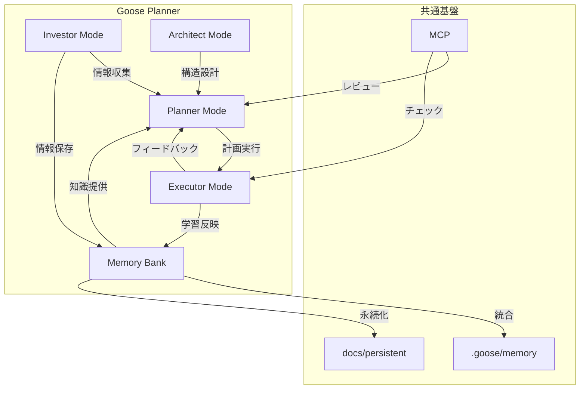

# Goose Planner 実装メモ

## 概要
Goose Plannerは従来のタスク管理システムを拡張し、情報収集、計画立案、実行、設計の各フェーズをモード分割することで、開発プロセスを効率化する統合システムを目指す。本メモは構想の分析と実装方針を記録する。

## 解決する課題
- タスク管理開始のイニシャルコスト削減
- Memory Bankの統合不足
- 手動のMCP呼び出しとコミット作業の自動化
- プランのレビューコスト削減
- 複雑な依存関係の管理改善

## モード構成と実装方針

### 1. Investor Mode（調査モード）
**目的**: 情報収集と分析を体系化する

**実装方法**:
- `investments/` ディレクトリ構造の導入
- URL取得と要約の自動化機能
- 情報構造化テンプレート（要約、コードスニペット、図表）

**優先実装項目**:
- fetch機能との統合
- 情報カテゴリ分類の自動化
- 検索可能なインデックス作成

### 2. Planner Mode（計画モード）
**目的**: 明確な目標設定と実行可能な計画立案

**実装方法**:
- `tasks/<task-name>/` ディレクトリに計画ファイル管理
- 目的確認のインタラクティブプロセス
- 関連情報の自動収集システム（persistentとinvestmentsから）
- 計画レビュー機能

**優先実装項目**:
- タスク依存関係の視覚化
- 計画テンプレートの標準化
- 既存知識との関連性チェック

### 3. Executor Mode（実行モード）
**目的**: 計画を効率的に実行し進捗を追跡

**実装方法**:
- 計画ファイルとコンテキストの自動読み込み
- `todo.md`のチェックリスト管理
- 実行中の学習のpersistentへの反映機能

**優先実装項目**:
- 進捗状況の視覚化
- 依存タスクの解決支援
- 学習内容の自動カテゴリ化

### 4. Architect Mode（設計モード）
**目的**: プロジェクト構造の設計と管理

**実装方法**:
- `persistents/`でアーキテクチャ構造管理
- ファイル初期化機能
- 構造更新の一貫性確保機能

**優先実装項目**:
- 基本的な初期化テンプレート
- 既存プロジェクト構造の解析機能
- 変更提案システム

## 共通基盤の実装

### メモリ管理システム
- `.goose/memory`と`docs/persistent`の統合インターフェース
- カテゴリとタグによる検索システム
- 自動学習内容更新の仕組み

### タスク管理フレームワーク
- セッション-タスク関連付けの一貫性確保
- アーカイブシステムの自動化
- タスク間の依存関係トラッキング

### MCP連携
- 非同期呼び出しキューイングシステム
- レビュー時の自動修正提案
- コミット前チェック機能

## 実装優先度

### フェーズ1（基盤構築）
1. ディレクトリ構造設計と基本ファイル管理
2. メモリ管理システムの基本機能
3. 各モードの基本テンプレート実装

### フェーズ2（機能拡充）
1. Investor/Planner機能の実装
2. 基本的なMCP連携機能
3. タスク依存関係の基本管理

### フェーズ3（高度機能）
1. 非同期処理システムの完全実装
2. 高度な依存関係解決メカニズム
3. Architect Modeの完全実装

## 次のステップ

1. プロトタイプディレクトリ構造の作成
   - `investments/`, `tasks/`, `persistents/`の基本構造実装

2. 最小機能セットの実装
   - Investor Modeの基本機能
   - Planner Modeのテンプレート作成

3. 既存の.goose/memoryとの統合インターフェースの設計
   - カテゴリとタグシステムの仕様策定

## メモ
- Mermaid図表はmonokaiテーマを標準とする
- 解決すべき優先課題：カテゴリ想起メカニズム、長期タスク管理
- MCPの並行処理についてはリソース消費とのバランスを考慮する必要あり

## 設計図

