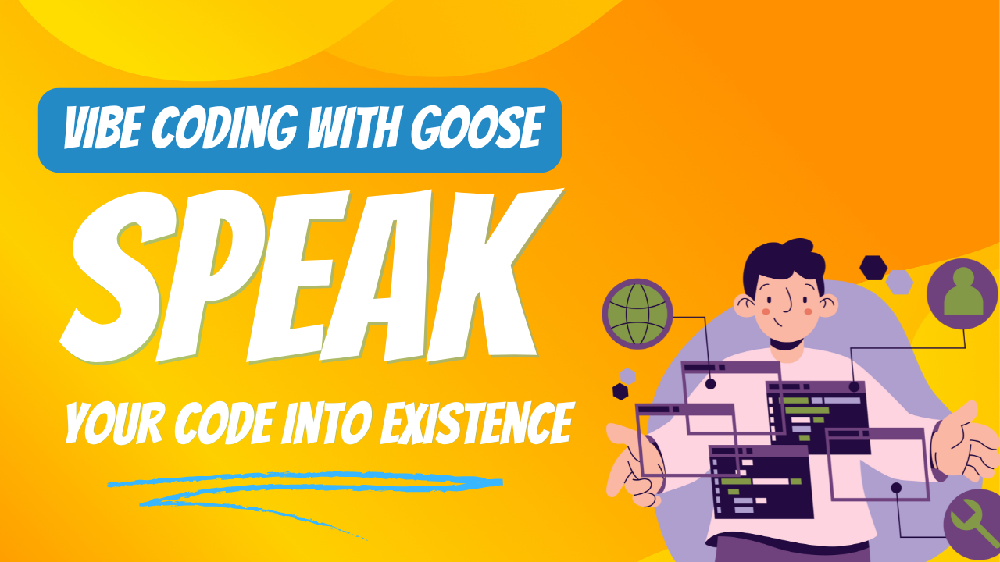

友達と話すように、欲しいものを声に出して説明するだけでアプリを作成する想像をしてみてください。これがバイブコーディングの魔法です：AIエージェントの助けを借りて、自然言語を動作するコードに変換します。プロンプトを入力するだけでも仕事はこなせますが、それを声に出して言うと別格の感覚です 🔥 新しい[スピーチ MCPサーバー](https://block.github.io/goose/docs/tutorials/speech-mcp)は文字通りチャットに参加しました。

<!--truncate-->

最近の[Wild Goose Caseライブストリーム](https://www.youtube.com/watch?v=Zey9GHyXlHY&ab_channel=BlockOpenSource)で、ホストの[Ebony Louis](https://www.linkedin.com/in/ebonylouis/)と[Adewale Abati](https://www.linkedin.com/in/acekyd/)は、BlockのAIツールチームから[Max Novich](https://www.linkedin.com/in/maksym-stepanenko-26404867)を迎え、エキサイティングな新しい拡張機能 - [スピーチ MCPサーバー](https://github.com/Kvadratni/speech-mcp)のデモンストレーションを行いました。

ライブストリーム中、Maxは音声コマンドのみを使用して - キーボードやマウスを必要とせずに - ウェブアプリケーション全体を作成しました。これにより、3D効果、シンセウェーブの美学、そしてインタラクティブな要素を持つ、活気に満ちたアニメーションウェブページが生まれました。すべてGooseとの自然な会話を通して作成されました。

<iframe class="aspect-ratio" src="https://www.youtube.com/embed/Zey9GHyXlHY?start=437&end=752" title="YouTube video player" frameborder="0" allow="accelerometer; autoplay; clipboard-write; encrypted-media; gyroscope; picture-in-picture; web-share" referrerpolicy="strict-origin-when-cross-origin" allowfullscreen></iframe>


## スピーチ MCPサーバー

[スピーチ MCP](https://github.com/Kvadratni/speech-mcp)は、Gooseのような AIエージェントとの音声インタラクションを可能にするオープンソースMCPサーバーです。特別なのは、完全にローカルにあなたのマシン上で動作することで、以下のような特徴があります：

- LLMに依存しない
- プライバシー重視
- クラウドベースの代替品と比較してコスト効率が高い
- インターネット接続なしでもアクセス可能

### 主な機能

1. **ローカル音声処理**: 2つの主要なモデルを使用:
   - Faster Whisper: 音声をテキストに変換する効率的な方法
   - Coqui TTS: 日本人エンジニアによる54の自然な音声を持つテキスト読み上げモデル

2. **音声選択**: さまざまな特性と個性を持つ54の異なる音声から選択可能

3. **マルチスピーカーナレーション**: 複数の声による会話を生成して再生

4. **音声文字起こし**: 音声/動画コンテンツをタイムスタンプとスピーカー検出付きでテキストに変換

## ライブデモのハイライト

デモンストレーション中、Maxはいくつかの印象的な機能を紹介しました：

1. **音声制御開発**:
   - アニメーションテキスト効果の作成
   - 3D変換の実装
   - グラデーションとグリッドによるシンセウェーブの美学の追加
   - 音楽コントロールの統合

2. **システム統合**:
   - 音声コマンドを使用してDiscordなどのアプリケーションを制御
   - ファイルシステムと開発環境のナビゲーション
   - 音声コンテンツの生成と管理

3. **自然なインタラクション**:
   - Gooseとの流暢な会話
   - リアルタイムフィードバックと調整
   - ドキュメント用のマルチボイスナレーション

## 始め方

スピーチ MCPサーバーを自分で試すには：

1. 必要な音声ライブラリ（PortAudio）をインストールします：
   ```bash
   # macOS用
   brew install portaudio
   
   # Linux用
   apt-get install portaudio  # または dnf install portaudio
   ```

2. Gooseでワンクリック[ディープリンクインストール](goose://extension?cmd=uvx&&arg=-p&arg=3.10.14&arg=speech-mcp@latest&id=speech_mcp&name=Speech%20Interface&description=Voice%20interaction%20with%20audio%20visualization%20for%20Goose)を使って直接拡張機能をインストール


## 開発に参加する

スピーチ MCPサーバーは[オープンソース](https://github.com/Kvadratni/speech-mcp)であり、貢献を歓迎しています。質問やコラボレーションについては、[Discord](https://discord.gg/block-opensource)でMaxに連絡することもできます。

指示に基づいて行動する力とツールを持つGooseのようなAIエージェントとの音声インタラクションは、未来がこれまでになく近く感じられる異なる種類の雰囲気を提供します。バイブコーディング、アクセシビリティの向上に興味があるか、あるいはGooseにJ.A.R.V.I.S.のような役割を持たせながらトニー・スタークのような気分を味わいたいかにかかわらず、スピーチ MCPサーバーは人間とAIのコラボレーションの未来への洞察を提供します - そして今日から利用可能です。

<head>
  <meta property="og:title" content="Gooseとスピーチ MCPでバイブコーディング" />
  <meta property="og:type" content="article" />
  <meta property="og:url" content="https://block.github.io/goose/blog/2025/03/28/vibe-coding-with-goose" />
  <meta property="og:description" content="音声制御によるコーディングとAIエージェントとの自然な会話を可能にする新しいスピーチ MCPサーバーを探求する" />
  <meta property="og:image" content="http://block.github.io/goose/assets/images/vibe-coding-74eafa34e7ae10cfb738feddecc98519.png" />
  <meta name="twitter:card" content="summary_large_image" />
  <meta property="twitter:domain" content="block.github.io/goose" />
  <meta name="twitter:title" content="Gooseとスピーチ MCPでバイブコーディング" />
  <meta name="twitter:description" content="音声制御によるコーディングとAIエージェントとの自然な会話を可能にする新しいスピーチ MCPサーバーを探求する" />
  <meta name="twitter:image" content="http://block.github.io/goose/assets/images/vibe-coding-74eafa34e7ae10cfb738feddecc98519.png" />
</head>